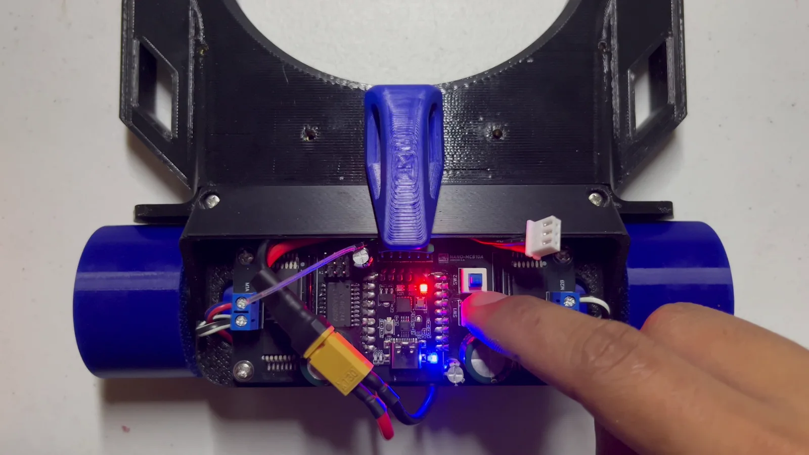
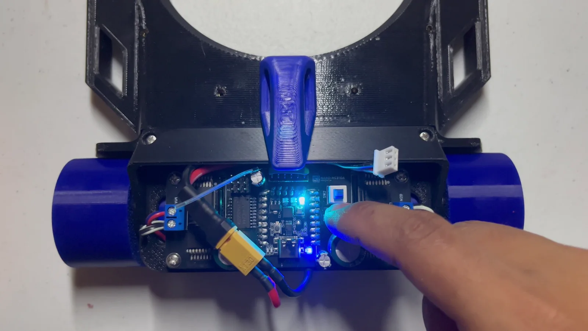
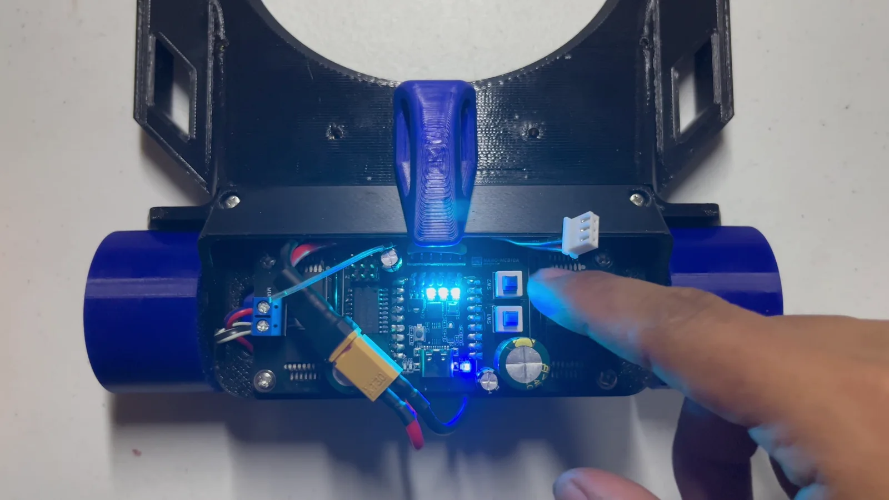
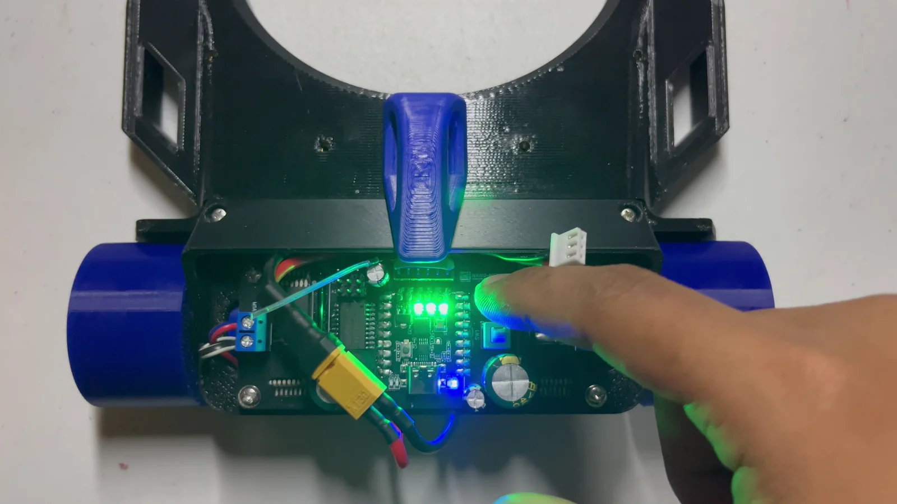
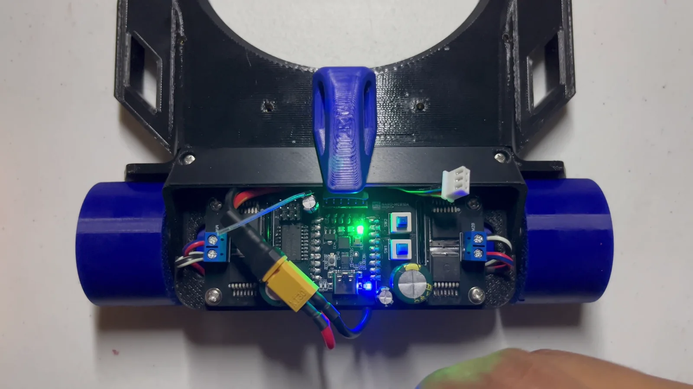

# Start using Hammerhead

Ready — RC Variant

This page currently covers the **RC Variant**. Instructions for starting and controlling the Bluetooth Variant will be added later.

## Identify your variant

| Variant | How to identify it | Guide status |
|---|---|---|
| **RC Variant** | Uses a handheld RC transmitter and a receiver installed inside the robot | Ready below |
| **Bluetooth Variant** | Uses a Bluetooth controller interface instead of the RC transmitter | Coming soon |

If your Basic Hammerhead does not yet have a receiver, or you need to replace its receiver, complete [RC Variant installation](rc-receiver-installation.html) first.

## Before powering the RC Variant

1. Place the robot on a stable stand so both wheels are clear of the table.
2. Keep hands, tools, cables, and loose objects away from the wheels.
3. Confirm that the RC receiver and transmitter are paired.
4. Center the transmitter's steering and forward/reverse controls.
5. Connect the robot battery.

<strong>Safe power-on behavior:</strong> Connecting the battery powers the controller board and RC receiver, but the robot does not begin driving immediately. The motors remain stopped until you press <strong>SW2</strong> to start.

## Start the robot

Press **SW2 once**. The three status LEDs illuminate red and the robot enters its running state.

<figure class="guide-figure step-figure">
  
  <figcaption><strong>Default startup color.</strong> Press SW2 once to start. The three board LEDs initially illuminate red.</figcaption>
</figure>

To stop or leave the running state, press and hold **SW2**. The robot returns to its stopped state so you can safely select another color.

## Robot color assigning

Use the status LEDs to assign a visible robot color before the match.

1. Make sure the robot is stopped. If it is running, press and hold **SW2** to exit.
2. Press and hold **SW1** to enter color selection.

<figure class="guide-figure step-figure">
  
  <figcaption><strong>Enter color selection.</strong> Keep SW1 held while choosing a color.</figcaption>
</figure>

3. While continuing to hold SW1, press **SW2** to cycle through the available LED colors.

<figure class="guide-figure step-figure">
  
  <figcaption>Press SW2 while holding SW1 to move to the next available color.</figcaption>
</figure>

<figure class="guide-figure step-figure">
  
  <figcaption>Continue cycling until the three LEDs display the color assigned to your robot.</figcaption>
</figure>

4. Release **SW1** when the required color is displayed.
5. Press **SW2 once** to start the robot using the selected color.

<figure class="guide-figure step-figure">
  
  <figcaption><strong>Confirm and start.</strong> After releasing SW1, press SW2 once to enter the running state.</figcaption>
</figure>

## Perform the first RC control test

Keep the robot supported with both wheels raised.

1. Move the forward/reverse control only a small amount.
2. Confirm that both wheels produce the expected forward and reverse response.
3. Check left and right steering.
4. Release the controls and confirm that both motors stop at neutral.
5. Press and hold SW2 to stop the robot after the test.

Do not place the robot on the floor until the controller returns reliably to neutral and every direction responds correctly.

## Before normal use

- [ ] Battery connection is secure.
- [ ] Receiver LED indicates a stable connection.
- [ ] Transmitter controls are centered.
- [ ] The intended robot color is displayed on all three LEDs.
- [ ] Both motors stop at neutral.
- [ ] The first movement test was completed with the wheels raised.
- [ ] Wheels and gears passed the [pre-use check](hardware/wheels-gears-checkup.html).

[Return to Hammerhead guides](./)
