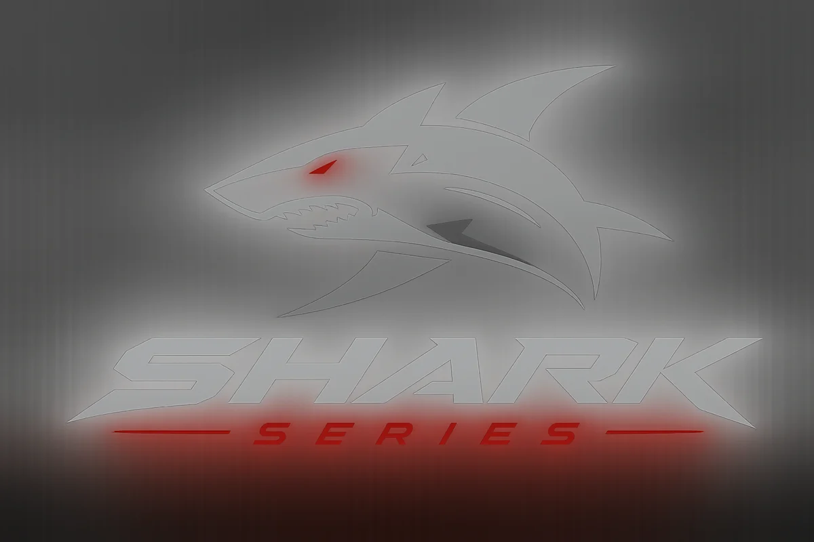
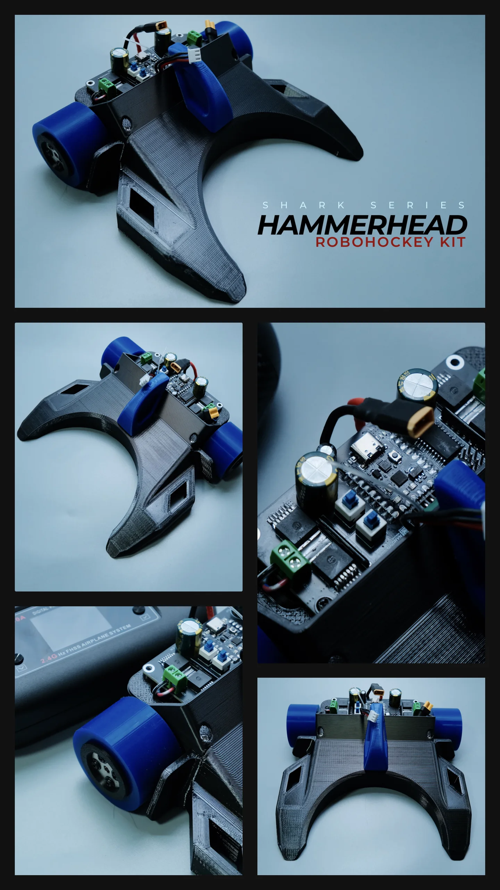

# Shark Series: Hammerhead Robohockey Kit

The **Hammerhead** is part of the Twentynine Robotics **Shark Series**—a competition-focused family built around speed, grip, durability, and adaptable control.

<figure class="brand-intro">
  
  <figcaption>SHARK SERIES<strong>Engineered with a predator's instinct.</strong> Fast response, aggressive traction, and hardware prepared for competition.</figcaption>
</figure>

Fast, durable, and competition-ready, Hammerhead combines high-speed drive hardware, high-grip silicone wheels, a front-biased chassis, and flexible RC or Bluetooth control.

<figure class="guide-figure product-showcase">
  
  <figcaption><strong>Meet the Hammerhead.</strong> This reference shows the assembled robohockey kit, front attachment, drive wheels, and NANO-MCB10A controller board. Select the image to view it at full size.</figcaption>
</figure>

  BUILT TO OUTPERFORM
  <h2>Competition-focused power in a compact platform</h2>
  
Hammerhead is built for fast acceleration, strong pushing performance, dependable runtime, and quick attachment changes between different robohockey formats.

## Specifications

  <section class="spec-card">
    Drive system
    <h3>High-speed 7.4 V motors</h3>
    
<strong>1,200–1,400 RPM</strong> through a <strong>1:35 gearbox</strong>. Each drive unit uses a modified GM25-370 assembly: a GM25 gearbox paired with a high-RPM 370 DC motor.

  </section>
  <section class="spec-card">
    Wheels
    <h3>High-grip silicone tread</h3>
    
<strong>50 mm × 30 mm</strong> wheels with <strong>Shore A 10 silicone</strong> and an anti-slip locking system. The soft tread provides strong arena grip and can be refreshed by cleaning it with isopropyl alcohol (IPA), then allowing it to dry completely before use.

  </section>
  <section class="spec-card">
    Battery &amp; power
    <h3>2S high-drain battery pack</h3>
    
<strong>2S 2,500 mAh</strong> pack built with Molicel P26A high-drain cells and an XT30 connector, selected to support the Hammerhead's fast acceleration and sustained match use.

  </section>
  <section class="spec-card">
    Chassis
    <h3>Purpose-matched materials</h3>
    
SUNLU PETG is used at the front for impact resistance. SUNLU ABS is used at the rear for stiffness, motor-vibration support, and stable heat transfer around the drive system.

  </section>
  <section class="spec-card">
    Control board
    <h3>NANO-MCB10A programmable controller</h3>
    
Powered by an Arduino Nano Super Mini paired with BTS7960 motor drivers, three analog-ready outputs, a Bluetooth/RC-ready port, and two onboard configuration switches. Kits are pre-coded for their supplied Bluetooth or RC Variant.

  </section>
  <section class="spec-card">
    Attachments
    <h3>Adaptable front nose</h3>
    
The front nose accepts interchangeable attachments. The current option is the <strong>Soccerbot Gladiator</strong> build, with more attachment updates planned.

  </section>

<strong>2S power only.</strong> The drive motors are rated for a 2S battery system. Using a battery above 2S can over-speed, overheat, and permanently damage the motors.

### Balanced for contact

Hammerhead carries more of its weight toward the front to create a **front-biased center of gravity (COG)**. The center of gravity is the point where the robot's mass is balanced. Moving it forward helps keep the nose and front attachment planted during acceleration, pushing, and contact with the ball or another robot.

### NANO-MCB10A power stage

The BTS7960 driver stage is configured for up to **10 A continuous use without a heatsink** and up to **20 A with correctly installed heatsinking and adequate cooling**. Actual safe current depends on airflow, wiring, ambient temperature, duty cycle, and installation quality.

### Tested performance

- Tested pushing capability exceeds **3 kg** and can reach up to **5 kg under controlled conditions** when the wheels are clean and the robot is set up correctly.
- Accelerates to full speed within seconds.
- Delivers up to approximately **30 minutes of continuous full-speed operation**.
- Can reach approximately **1 hour 30 minutes of typical mixed use**. During beta testing, some users completed an entire championship event without replacing the 2,500 mAh battery.

<strong>Performance varies.</strong> Runtime and pushing results depend on wheel cleanliness, surface grip, robot setup, attachment weight, driving style, battery condition, and match conditions.

  START HERE — IDENTIFY YOUR VARIANT
  <h2>Which Hammerhead do you have?</h2>
  
The RC Variant uses a handheld RC transmitter and receiver. The Bluetooth Variant is controlled through its Bluetooth interface.

  <section>
    <h2>RC Variant</h2>
    
Use the handheld RC transmitter supplied with the kit.

    <a class="directory-link" href="getting-started.html"><strong>Start using the RC Variant</strong><small>Power on, assign the robot color, start, stop, and perform the first control test.</small>Ready</a>
  </section>
  <section>
    <h2>Bluetooth Variant</h2>
    
The Bluetooth startup and application procedure is still being prepared.

    <a class="directory-link" href="controllers/bluetooth-variant-installation.html"><strong>Bluetooth Variant guide</strong><small>Installation and operation instructions will be added here.</small>Coming soon</a>
  </section>
  <section>
    <h2>Getting started</h2>
    <a class="directory-link" href="getting-started.html"><strong>Start using Hammerhead</strong><small>RC Variant startup is available now; Bluetooth instructions will be added later.</small>Ready</a>
    <a class="directory-link" href="getting-started.html#robot-color-assigning"><strong>Robot color assigning</strong><small>Use SW1 and SW2 to select the three status LEDs' color.</small>Ready</a>
    <a class="directory-link" href="hardware/wheels-gears-checkup.html"><strong>Wheels &amp; gears check-up</strong><small>Inspect the shared wheel, flange-coupling, set-screw, and gearbox system.</small>Ready</a>
  </section>
  <section>
    <h2>Controllers</h2>
    <a class="directory-link" href="controllers/bluetooth-variant-installation.html"><strong>Bluetooth Variant installation</strong><small>Bluetooth controller installation and setup.</small>Coming soon</a>
    <a class="directory-link" href="rc-receiver-installation.html"><strong>RC Variant installation</strong><small>Install a receiver in a Basic Hammerhead or replace the receiver in an RC Variant.</small>Ready</a>
  </section>
  <section>
    <h2>Hardware and upgrades</h2>
    <a class="directory-link" href="assembly/robo-z-attachment.html"><strong>ROBO Z Compliant Robohockey Attachment</strong><small>Installation and final attachment checks.</small>Pending</a>
    <a class="directory-link" href="assembly/soccerbot-gladiator-attachment.html"><strong>Soccerbot Gladiator Attachment Guide</strong><small>Assembly, mounting, and final attachment checks.</small>Pending</a>
  </section>

[Return to all kits](../)
