# Install an RC receiver

In progress — review draft

Use this guide when upgrading a **Basic Hammerhead Robohockey Kit** that was supplied without an RC receiver.

<figure class="guide-figure product-showcase">
  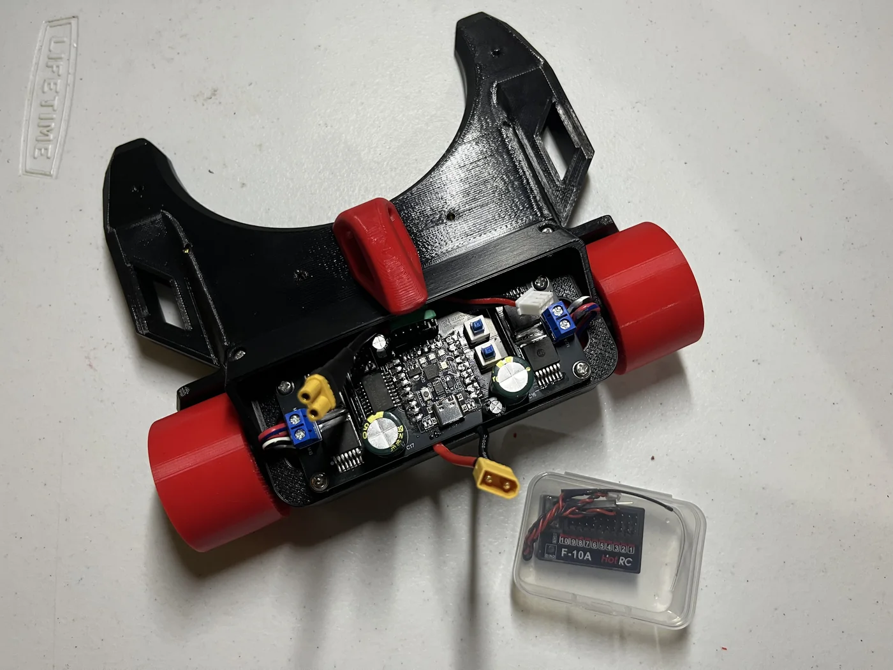
  <figcaption><strong>Hammerhead RC upgrade.</strong> The receiver fits beneath the controller area after the battery has been removed.</figcaption>
</figure>

<strong>Disconnect the battery first.</strong> Keep the robot unpowered while opening it, connecting the receiver, routing wires, or swapping receiver plugs. During the first powered test, support the robot so both wheels can spin without touching the table.

## What you need

- Basic Hammerhead Robohockey Kit
- Compatible RC receiver and transmitter
- Hammerhead RC cable with two 3-pin Dupont receiver plugs
- Screwdriver for the battery-cover screws
- A stable stand or block that keeps both wheels raised

## 1. Position the robot

Turn the Hammerhead over on a clean, stable surface. The red bottom battery cover should face you.

<figure class="guide-figure step-figure">
  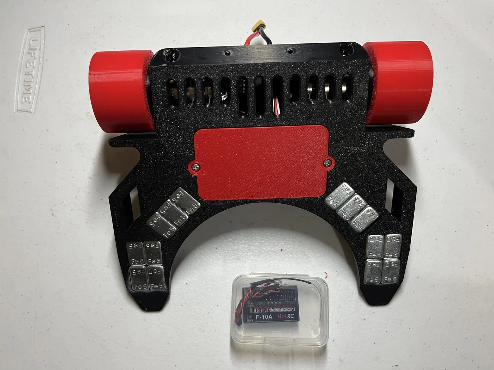
  <figcaption><strong>Correct orientation.</strong> Place the robot upside down with the red battery cover easy to reach.</figcaption>
</figure>

Confirm that the battery is disconnected before removing any screw.

## 2. Remove the battery cover

Remove the two screws securing the red battery cover. The marked photo shows the correct screws. Keep them together in a safe place.

<figure class="guide-figure step-figure">
  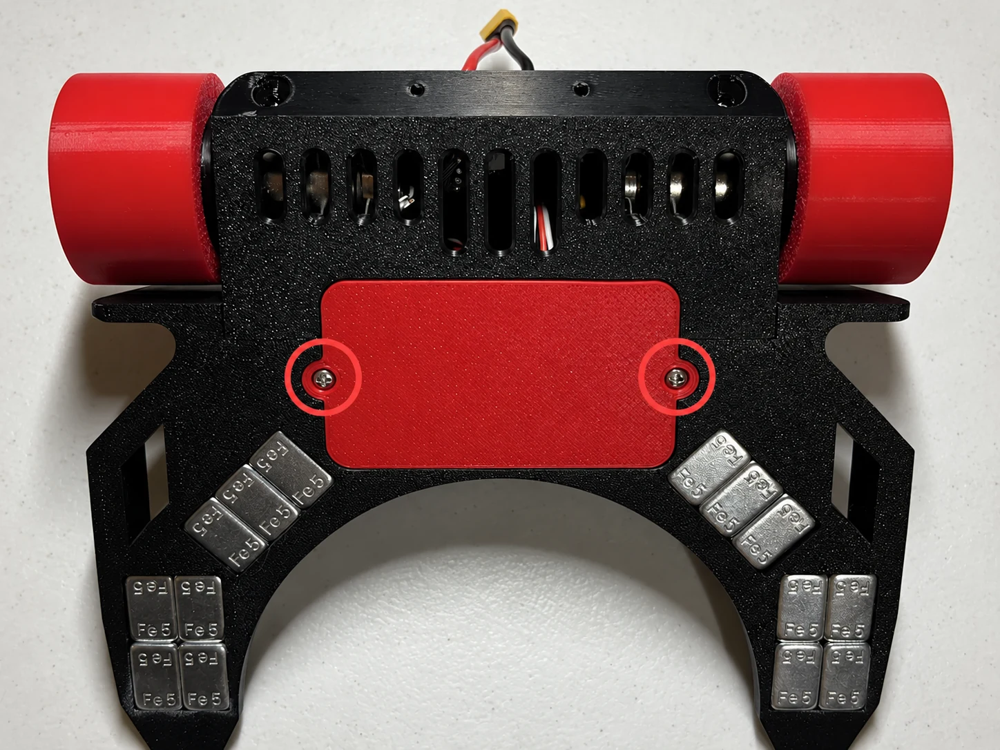
  <figcaption><strong>Remove these two screws.</strong> The coral circles identify the battery-cover screws; do not remove the black chassis screws along the top edge.</figcaption>
</figure>

After removing both screws, lift the cover away from the chassis.

<figure class="guide-figure step-figure">
  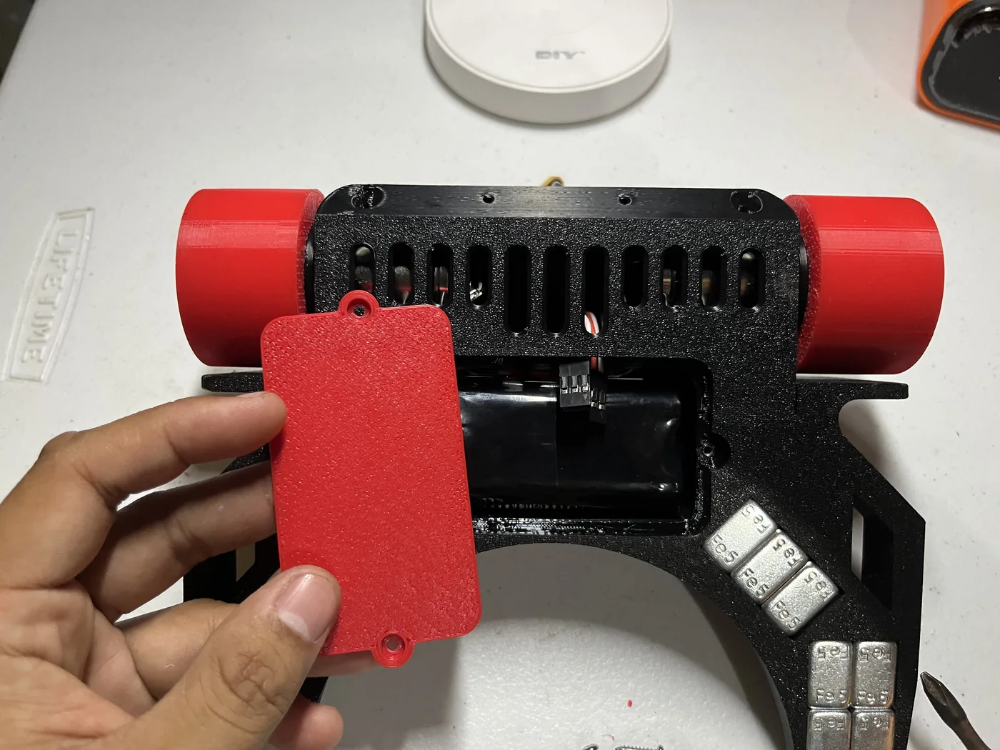
  <figcaption>Remove the screws before lifting the battery cover.</figcaption>
</figure>

## 3. Slide out the battery

Slowly slide the battery out. If a wire catches on the controller board or chassis, stop and clear its path. Never pull the battery by its wires.

<figure class="guide-figure step-figure">
  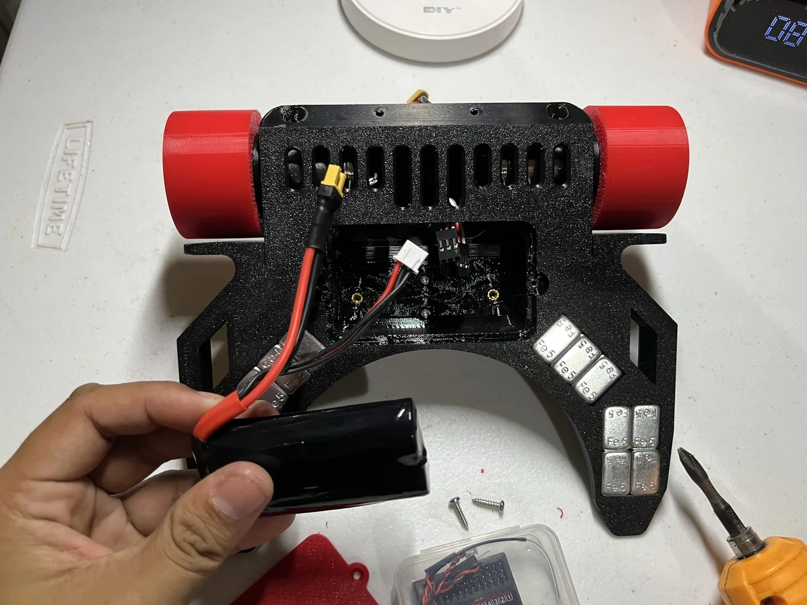
  <figcaption>Guide the battery and its wires out together without forcing them.</figcaption>
</figure>

Before moving anything else, remember the positions of the main battery connector and the smaller balance connector. They must return to the same clear spaces during reassembly.

## 4. Connect the RC cable to the receiver

Find the two 3-pin Dupont plugs on the Hammerhead RC cable. Connect them to the receiver channels assigned to **forward/reverse** and **left/right steering** for the supplied transmitter.

| Wire color | Receiver pin |
|---|---|
| White | Signal (`S`) |
| Red | `+5 V` or positive (`+`) |
| Black | Ground (`GND` or `−`) |

<strong>Do not reverse the wire order.</strong> White must remain on signal, red on positive, and black on ground. The exact channel numbers depend on the controller supplied with the kit and will be added after final controller verification.

<figure class="guide-figure step-figure">
  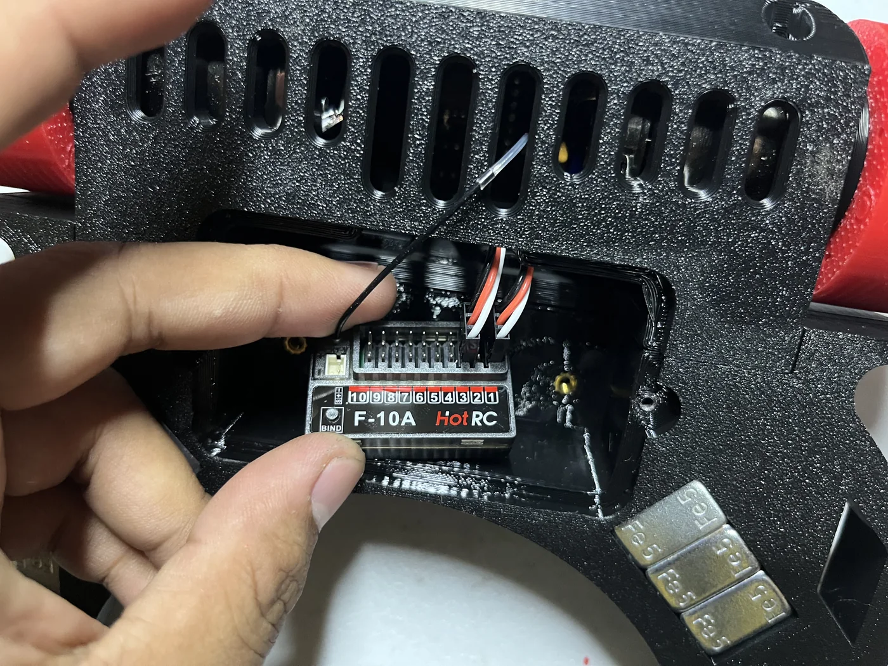
  <figcaption>Connect both complete 3-pin plugs while keeping signal, positive, and ground correctly aligned.</figcaption>
</figure>

## 5. Check the robot-side connection

Make sure the other end of the RC cable is fully seated on the Hammerhead controller board. Place the receiver antenna on top of the NANO-MCB10A board to maximize signal reception. Keep the channel leads away from screw holes, the battery edges, and the wheels.

<figure class="guide-figure step-figure">
  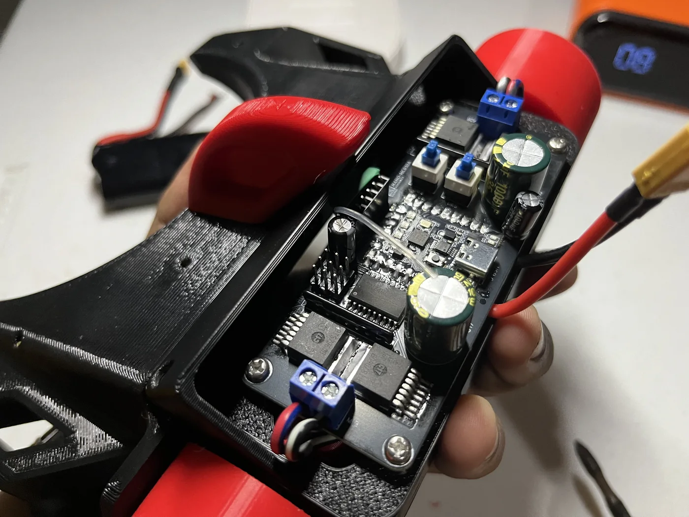
  <figcaption><strong>Receiver antenna position.</strong> Check that the antenna is sitting on top of the <strong>NANO-MCB10A board</strong> to maximize signal reception.</figcaption>
</figure>

<figure class="guide-figure step-figure">
  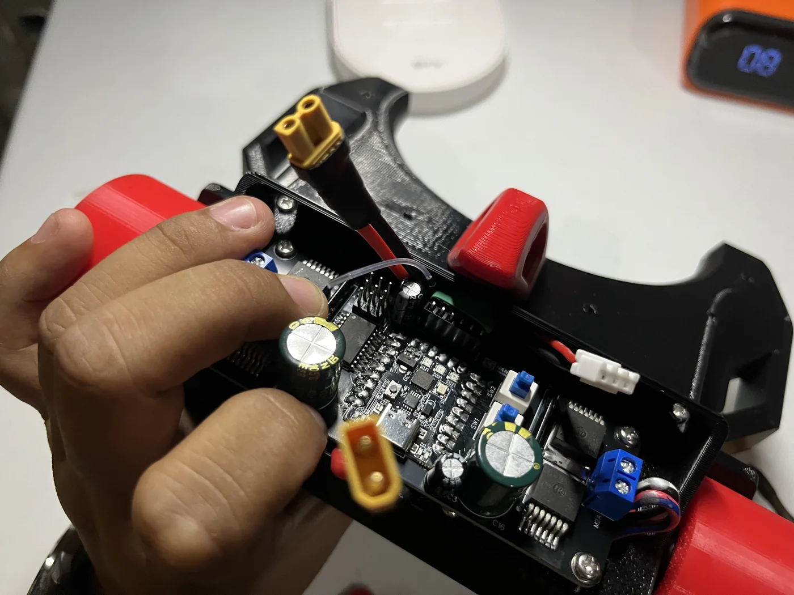
  <figcaption><strong>Match this cable placement.</strong> As viewed in the photo, the battery's XT30 connector should exit on the <strong>left</strong>, the RC signal cable should remain in the <strong>center</strong>, and the battery balance connector should exit on the <strong>right</strong>.</figcaption>
</figure>

## 6. Perform the first powered test

This temporary connection is used to power and pair the receiver, then confirm that the forward/reverse and steering plugs are on the correct receiver channels.

<figure class="guide-figure step-figure">
  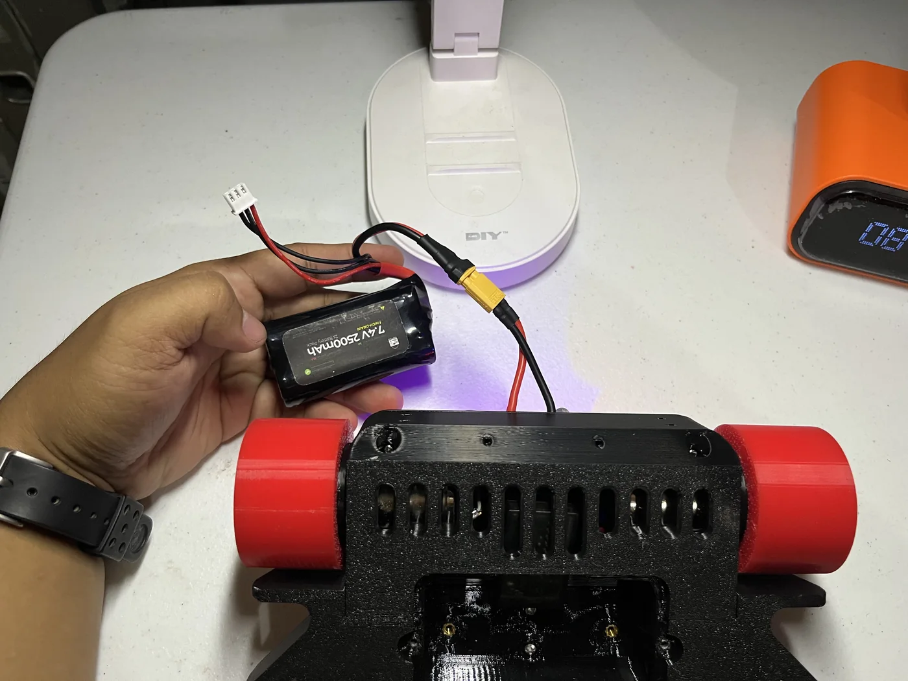
  <figcaption><strong>Temporary test connection.</strong> Keep the battery outside the compartment while pairing the receiver and checking the channel assignments.</figcaption>
</figure>

<strong>The robot will not drive as soon as the battery is connected.</strong> Connecting the battery powers the receiver and control board, but the motors remain stopped until you press <strong>SW2</strong> to start the Hammerhead.

1. Place the robot on a stable stand with both wheels clear of the table.
2. Keep all loose cables, tools, and fingers away from the wheels.
3. Leave the robot unstarted while pairing the receiver.
4. Temporarily reconnect the robot battery as shown above.
5. Confirm that the receiver status LED turns on.

<figure class="guide-figure step-figure guide-figure--compact">
  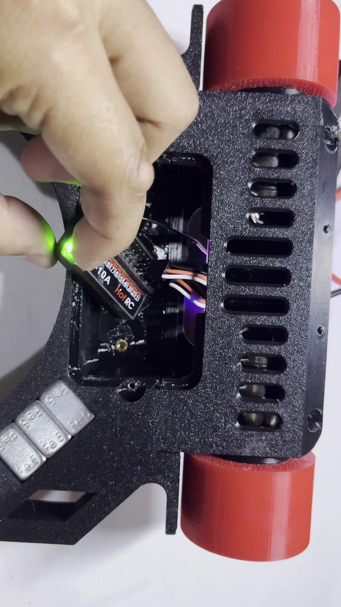
  <figcaption><strong>Power checkpoint.</strong> The supplied video shows the receiver's green status LED illuminating when power reaches it.</figcaption>
</figure>

If the receiver LED does not illuminate, disconnect the battery and recheck the plug orientation and board-side connection.

### Pair the receiver and controller

Use the pairing method for the controller and receiver supplied with the kit.

**HotRC HT-10A with F-10A receiver**

1. Leave the HT-10A switched off and keep both sticks centered.
2. With the receiver powered by the temporarily connected robot battery, press the receiver's **BIND** button once. Its green LED should flash quickly.
3. Switch on the HT-10A, open **Pairing Settings**, and start pairing.
4. Wait for the receiver LED to remain steadily green.

**HotRC CT-6A with F-06A receiver**

1. Leave the CT-6A switched off and release the wheel and trigger so they return to center.
2. With the receiver powered, press the receiver's **BIND** button once. Its green LED should flash quickly.
3. Switch on the CT-6A.
4. Wait for the receiver LED to remain steadily green.

<strong>Pairing checkpoint:</strong> A steady green receiver LED indicates a successful connection. If it continues blinking, repeat the pairing procedure for the supplied controller before testing the channels.

### Start the Hammerhead

1. Press **SW2** once. The three LEDs should illuminate red.
2. To choose a different color, long-press **SW2** to exit.
3. Press and hold **SW1** to enter color selection.
4. While holding SW1, press **SW2** to cycle through the available colors.
5. Release SW1 when the desired color appears.
6. Press **SW2** once to start the robot.

### Check the controls

Use small transmitter movements during this first test:

1. Apply a small forward command and confirm that both motors produce forward travel together.
2. Apply a small reverse command.
3. Check left and right steering.
4. Release the controls and confirm that both motors stop at neutral.

If forward/reverse and steering are assigned to the wrong controls, stop the robot and disconnect the battery. Swap the positions of the **two complete 3-pin receiver plugs**, then reconnect power and repeat the raised-wheel test.

<strong>Swap complete plugs only.</strong> Never rearrange or reverse the individual white, red, and black wires.

## 7. Disconnect power and place the receiver

After the controls pass the test, stop the robot and disconnect the battery again.

Place the receiver in the lower compartment beneath the controller area. Keep its antenna or signal wire routed upward so the battery and cover cannot pinch it.

<figure class="guide-figure step-figure">
  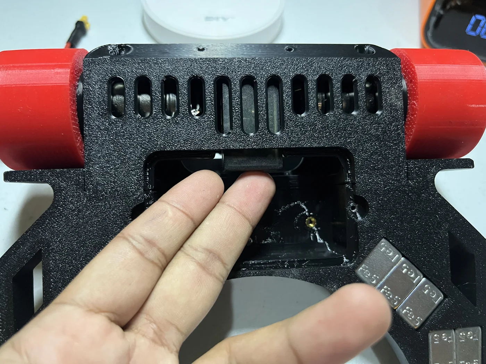
  <figcaption>Place the receiver underneath the controller area without pulling its leads. Keep the receiver wire directed toward the upper opening.</figcaption>
</figure>

## 8. Reinstall the battery and cover

Return the parts in the reverse order used to remove them.

### Return the battery

Slide the battery back into its original position. Guide the main power and balance connectors into their original clear spaces instead of forcing the battery past them.

<figure class="guide-figure step-figure">
  
  <figcaption>Use the removal photo in reverse: guide the battery and its wires back into the compartment together.</figcaption>
</figure>

### Route the cables out at the top

Route all three connections through the upper opening shown below. Match their placement before installing the cover: the battery's XT30 connector on the left, the RC signal cable in the center, and the battery balance connector on the right. Confirm that no cable crosses the battery-cover edge or either screw hole.

<figure class="guide-figure step-figure">
  
  <figcaption><strong>Final cable position.</strong> From left to right as shown: <strong>XT30 battery connector</strong>, <strong>RC signal cable</strong>, then <strong>battery balance connector</strong>.</figcaption>
</figure>

### Replace the cover

Position the red cover over the battery compartment and make sure it sits flat without force.

<figure class="guide-figure step-figure">
  
  <figcaption>Use the cover-removal photo in reverse and lower the red cover into position.</figcaption>
</figure>

### Reinstall the two cover screws

Insert the two screws marked below and tighten them gently. Do not overtighten screws installed into printed plastic.

<figure class="guide-figure step-figure">
  
  <figcaption><strong>Battery-cover screws.</strong> Secure the cover using the two circled screws.</figcaption>
</figure>

If the cover does not sit flat, remove it and correct the battery or cable position. Do not use the screws to pull a misaligned cover closed.

## Final check

- [ ] Both receiver plugs are secure.
- [ ] White is on signal, red is on positive, and black is on ground.
- [ ] The receiver status LED illuminates during the powered test.
- [ ] Forward/reverse and left/right respond to the intended controls.
- [ ] Both motors stop when the transmitter returns to neutral.
- [ ] The receiver is placed beneath the controller area.
- [ ] The receiver antenna rests on top of the NANO-MCB10A board.
- [ ] The XT30, RC signal cable, and balance connector exit in the shown left-center-right order.
- [ ] No receiver or battery wire is pinched.
- [ ] The battery cover sits flat and its screws are secure.

<strong>Before arena use:</strong> Repeat a short raised-wheel test after closing the cover. Place the robot on the floor only after the controls respond correctly and both motors stop at neutral.

[Return to Hammerhead guides](./)
