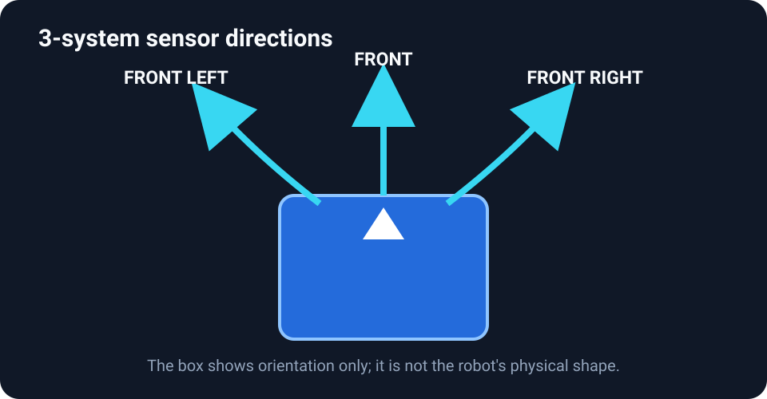
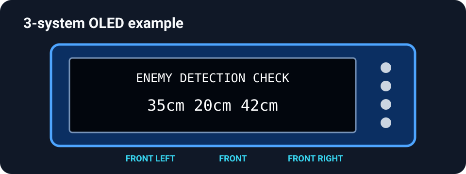
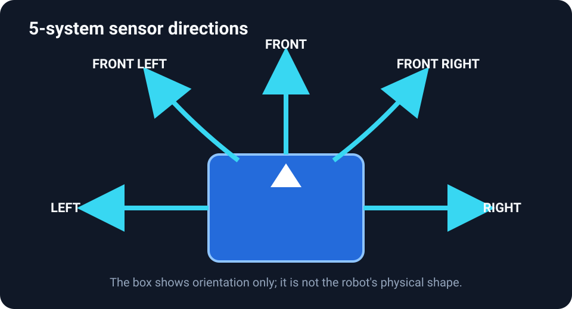
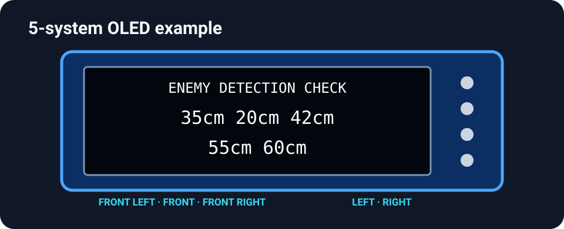

# Enemy-detection sensor check

This is a **functional check**, not a potentiometer calibration. It confirms that each distance sensor reacts to a target. The current program limits displayed distance readings to approximately 10–80 cm.

## Enter the enemy-sensor screen

1. From the **RC/RMT** screen, press **SW1** and **SW2** together for **two seconds**.
2. Release both buttons when **CAL MODE** appears. It remains in CAL MODE after release.
3. Press **SW1 once** for `LINE SENSOR ADJUST`.
4. Press **SW1 again** for `ENEMY DETECTION CHECK`.

## 3-system arrangement

The basic 3-system model reads **front left**, **front**, and **front right**, in that order.

<figure class="guide-figure">
  
  <figcaption><strong>MH-CAL-ENEMY-01.</strong> Direction reference for the basic 3-system configuration.</figcaption>
</figure>

The OLED places those three distances on one value line:

<figure class="guide-figure guide-figure--compact step-figure">
  
  <figcaption><strong>MH-CAL-ENEMY-02.</strong> Example values only. Read them left to right as front left, front, and front right.</figcaption>
</figure>

## 5-system arrangement

The advanced 5-system model adds a sensor facing directly **left** and another facing directly **right**.

<figure class="guide-figure">
  
  <figcaption><strong>MH-CAL-ENEMY-03.</strong> Direction reference for the advanced 5-system configuration.</figcaption>
</figure>

The first OLED value line is front left, front, and front right. The second value line is left and right:

<figure class="guide-figure guide-figure--compact step-figure">
  
  <figcaption><strong>MH-CAL-ENEMY-04.</strong> Example values only. The top value row contains the three front sensors; the bottom row contains left and right.</figcaption>
</figure>

## Check one sensor at a time

1. Keep the area in front of every sensor clear and observe the baseline readings.
2. Hold a flat, matte target in front of only one sensor.
3. Move the target slowly closer. Only that sensor's distance should decrease.
4. Move it away. The distance should increase toward the clear reading.
5. Repeat three times, then test the next direction.

Three-sensor models use front-left, front, and front-right sensors. Five-sensor models add left and right sensors. Do not copy the expected layout from one model to another without checking the installed hardware.

## A reading stays fixed

Power off before touching wiring. Check for a blocked lens, loose connector, damaged cable, or a target surface that reflects poorly. Compare with another sensor using the same target and distance. If the fault remains, record which position fails and see [troubleshooting](../troubleshooting/).
