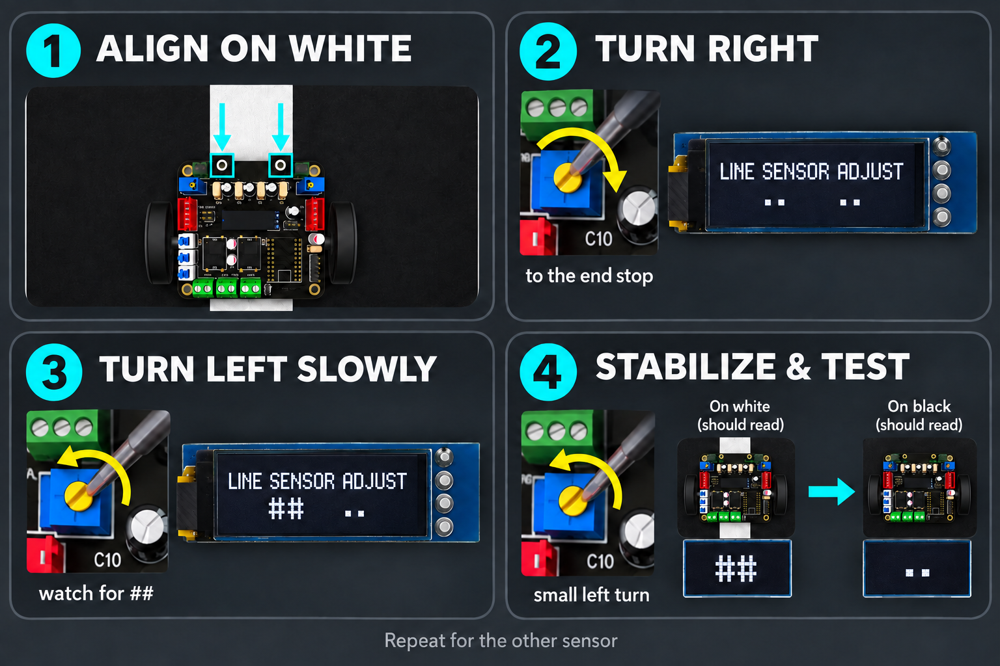

# Line-sensor calibration

Calibration teaches the robot to tell the white arena boundary from the black arena floor. When calibration is correct, each sensor shows:

- `##` while it is over the **white boundary**
- `..` while it is over the **black floor**

Calibrate the sensors at the robot's normal driving height. A different height can change the reading.

## What you need

- The Mini Hunter with its OLED and line sensors connected
- A sample of the white boundary and black arena surface
- A small screwdriver that fits the blue adjustment potentiometers
- A safe way to keep the wheels and weapon from moving

> **Safety:** Switch off or disconnect the weapon system before working near the robot. Support the robot so it cannot drive away while you use the menu.

## Find the two line-sensor adjustments

The blue potentiometers at the upper-left and upper-right of the FullVision board adjust the two line sensors. Adjust only one side at a time so you can see which OLED reading changes.

<figure class="guide-figure">
  
  <figcaption><strong>MH-CAL-LINE-01.</strong> Location of the two line-sensor potentiometers. This is a location guide based on the supplied, incomplete board artwork; it is not a complete wiring diagram.</figcaption>
</figure>

On the OLED, the **left pair** belongs to the left line-sensor input and the **right pair** belongs to the right input:

| OLED reading | Meaning |
| --- | --- |
| `....` | Both sensors see black |
| `##..` | Left sees white; right sees black |
| `..##` | Left sees black; right sees white |
| `####` | Both sensors see white |

## Calibrate one sensor

1. [Enter CAL MODE](./) and press **SW1 once** until the OLED says `LINE SENSOR ADJUST`.
2. Place the robot so **both line sensors are aligned over the white boundary**. Keep the robot at its normal ride height.
3. Choose which sensor to adjust first. Use the potentiometer on that sensor's side and watch its matching pair on the OLED.
4. Turn that potentiometer slowly **to the right (clockwise)** until it reaches its end stop. You may hear or feel a faint repeated click at the limit. Stop turning harder when you reach it. The matching OLED pair should show `..`.
5. Turn the same potentiometer **to the left (counterclockwise)** very slowly. Stop when its matching reading begins to flash or change to `##`.
6. Give it only a **tiny additional turn to the left** until `##` remains stable. Do not turn it one full revolution after the reading changes.

<figure class="guide-figure">
  
  <figcaption><strong>MH-CAL-LINE-02.</strong> Adjust one sensor at a time: align on white, turn right to the end stop, then turn left slowly until its `##` reading becomes stable.</figcaption>
</figure>

7. Move that sensor between the two surfaces. It should show `##` on white and `..` on black.
8. Return both sensors to the white boundary and repeat Steps 3–7 for the other sensor.

If you turn a potentiometer but the opposite OLED pair changes, you selected the other sensor's adjustment. Return to the last stable setting and use the other potentiometer.

## Final test

Check all four combinations at least three times:

| Left sensor | Right sensor | Expected display |
| --- | --- | --- |
| Black | Black | `....` |
| White | Black | `##..` |
| Black | White | `..##` |
| White | White | `####` |

The readings should change cleanly and remain stable while the robot is held still. If they flicker, clean the sensor faces, restore the normal ride height, move away from strong direct light, and make another tiny adjustment.

> **Before a match:** Test the sensors on the actual arena whenever possible. Paint, lighting, dirt, and sensor height can change the switching point.
