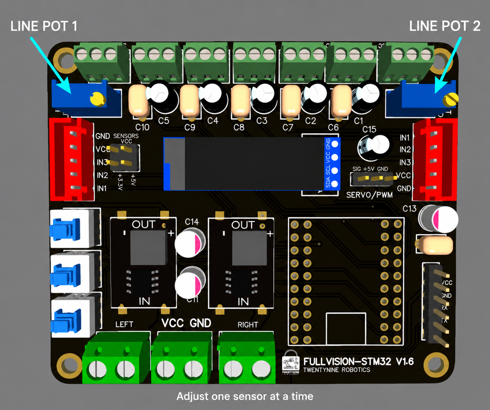
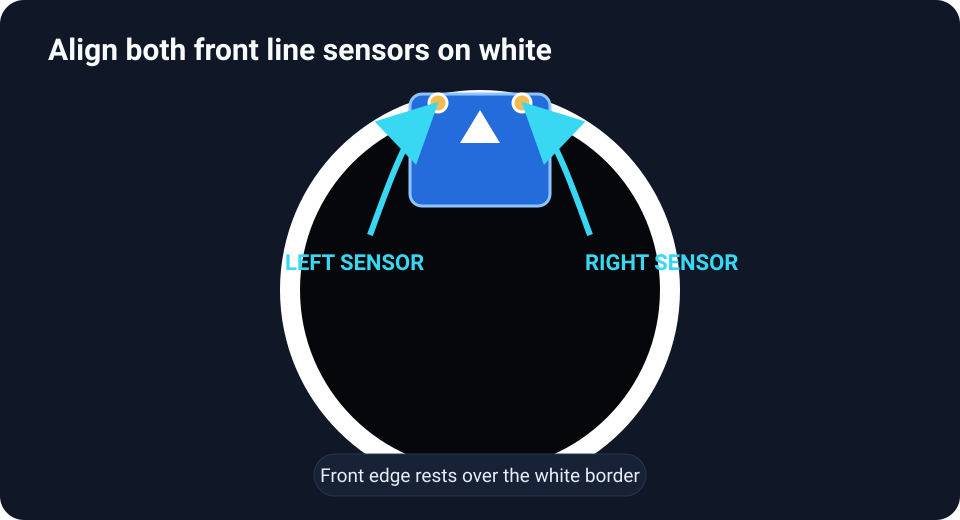
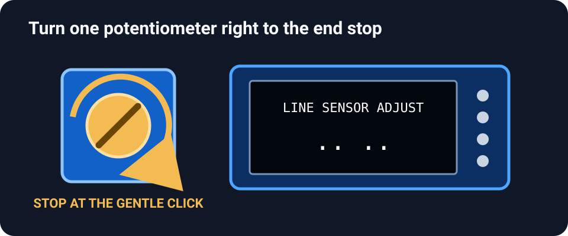
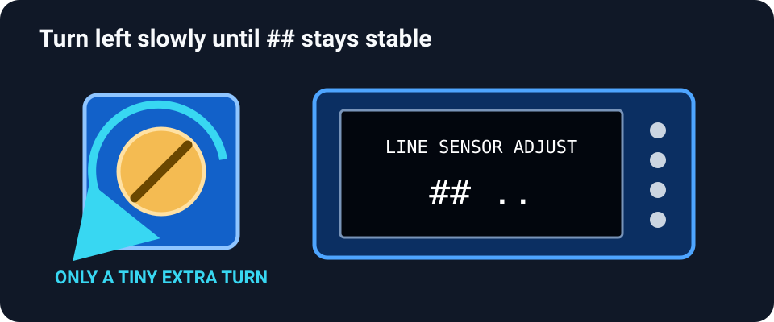

# Line-sensor calibration

Calibration teaches the robot to tell the white arena boundary from the black arena floor. When calibration is correct, each sensor shows:

- `##` while it is over the **white boundary**
- `..` while it is over the **black floor**

Calibrate the sensors at the robot's normal driving height. A different height can change the reading.

## What you need

- The Mini Hunter with its OLED and line sensors connected
- A sample of the white boundary and black arena surface
- A small screwdriver that fits the blue adjustment potentiometers
- A safe way to keep the wheels and weapon from moving

> **Safety:** Switch off or disconnect the weapon system before working near the robot. Support the robot so it cannot drive away while you use the menu.

## 1 Enter CAL MODE

1. Power on the robot and use the latching **MODE** switch to show the **RC/RMT** screen.
2. Press **SW1** and **SW2** together.
3. Keep holding both buttons for **two seconds**.
4. When the OLED shows **CAL MODE**, release both buttons. CAL MODE remains active after the buttons are released.

## 2 Select line calibration

Press **SW1 once**. The OLED should change from CAL MODE to `LINE SENSOR ADJUST`. If you press past it, continue pressing SW1 until the choices cycle back to the line-sensor screen.

## 3 Find the two adjustments

The blue potentiometers at the upper-left and upper-right of the FullVision board adjust the two line sensors. Adjust only one side at a time so you can see which OLED reading changes.

<figure class="guide-figure">
  
  <figcaption><strong>MH-CAL-LINE-01.</strong> Location of the two line-sensor potentiometers. This is a location guide based on the supplied, incomplete board artwork; it is not a complete wiring diagram.</figcaption>
</figure>

On the OLED, the **left pair** belongs to the left line-sensor input and the **right pair** belongs to the right input:

| OLED reading | Meaning |
| --- | --- |
| `....` | Both sensors see black |
| `##..` | Left sees white; right sees black |
| `..##` | Left sees black; right sees white |
| `####` | Both sensors see white |

## 4 Align the sensors on white

Place the robot inside a black circular test area and move it toward the white border. Stop when the **front line sensors are directly over the white border**. Keep the robot at its normal ride height.

<figure class="guide-figure">
  
  <figcaption><strong>MH-CAL-LINE-02.</strong> The blue box shows orientation only. Align both front line sensors directly over the white border.</figcaption>
</figure>

## 5 Adjust the first sensor

Choose either sensor first. Use the potentiometer on that sensor's side and watch its matching pair on the OLED.

Turn the potentiometer slowly **to the right (clockwise)** until it reaches its end stop. You may hear or feel a faint repeated click at the limit. Stop applying extra force. The matching OLED pair should show `..`.

<figure class="guide-figure guide-figure--compact step-figure">
  
  <figcaption><strong>MH-CAL-LINE-03.</strong> Turn right only until the potentiometer reaches its gentle clicking end stop.</figcaption>
</figure>

Now turn the same potentiometer **to the left (counterclockwise)** very slowly. Stop when its matching reading begins to flash or change to `##`. Give it only a **tiny additional turn left** until `##` remains stable. Do not turn it one full revolution after the reading changes.

<figure class="guide-figure guide-figure--compact step-figure">
  
  <figcaption><strong>MH-CAL-LINE-04.</strong> Turn left slowly and stop after the matching `##` becomes stable.</figcaption>
</figure>

Move that sensor between the white border and black floor. It should show `##` on white and `..` on black.

## 6 Repeat for the other sensor

Return both sensors to the white border. Adjust the other potentiometer using the same right-to-end-stop, slow-left, stabilize, and black/white test sequence.

If you turn a potentiometer but the opposite OLED pair changes, you selected the other sensor's adjustment. Return to the last stable setting and use the other potentiometer.

## Final test

Check all four combinations at least three times:

| Left sensor | Right sensor | Expected display |
| --- | --- | --- |
| Black | Black | `....` |
| White | Black | `##..` |
| Black | White | `..##` |
| White | White | `####` |

The readings should change cleanly and remain stable while the robot is held still. If they flicker, clean the sensor faces, restore the normal ride height, move away from strong direct light, and make another tiny adjustment.

  Before a match
  
Test the sensors on the actual arena whenever possible. Paint, lighting, dirt, and sensor height can change the switching point.

  Why this matters
  
An uncalibrated or unstable line sensor can make the robot leave the arena even when no opponent is nearby, react to the floor as if it were the boundary, or ignore the white border completely.

