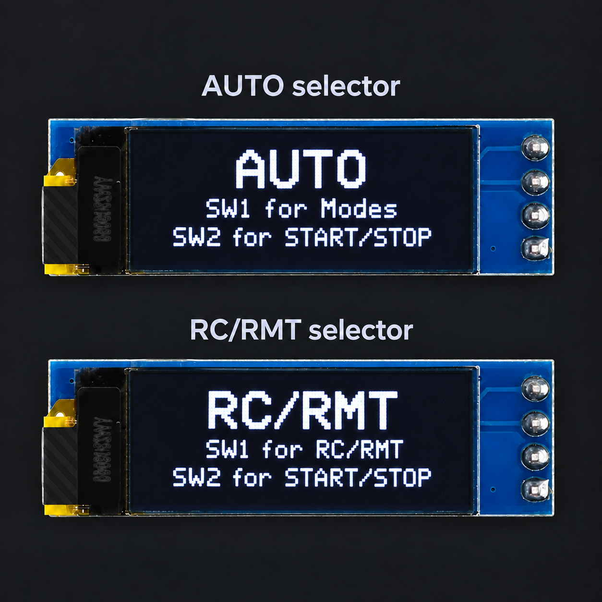

# Start using your Mini Hunter

Start here — no programming required

Your Mini Hunter normally arrives with working firmware already installed. You do **not** need to upload code before learning how to use the robot.

This guide takes you from checking the battery to a safe first drive or autonomous test. Programming is optional and is kept in a separate section for users who want to change the firmware.

## Learn the three board controls

The FullVision STM32 board uses three switches:

| Control | Type | What it does |
|---|---|---|
| **MODE** | Latching switch | Changes between the RC/RMT side and the AUTO side |
| **SW1** | Momentary switch | Moves to the next choice or changes a displayed value |
| **SW2** | Momentary switch | Selects, confirms, or starts the displayed choice |

Read the OLED before pressing another switch. It tells you which side of the menu is active and what SW1 and SW2 do on that screen.

## 1. Perform the first safety check

Before connecting power:

1. Put the robot on a stable table.
2. Confirm that the battery's yellow XT30 connector is disconnected.
3. Check that the wheels are secure and can rotate without rubbing the chassis.
4. Check that sensor and motor cables are fully connected and clear of the wheels.
5. Make sure the blade or front attachment is secure.
6. Remove tools and loose objects from the test area.
7. Support the robot so both wheels are off the surface for the first powered test.

See [Wheels & gears check-up](hardware/wheels-gears-checkup.html) for the current maintenance procedure.

<strong>Keep the wheels raised for the first test.</strong> The selected mode may move the motors as soon as it starts.

## 2. Identify your power arrangement

Mini Hunter units can differ slightly depending on when they were built.

### Newer unit with a loop switch key

Newer units have a removable **loop switch key**. It is normally already plugged in when the kit is supplied, while the battery's XT30 connector remains disconnected.

- Leave the loop key installed during ordinary preparation.
- Use it as a quick safety disconnect when the robot must be stopped immediately and event rules permit its removal.
- The normal main-power connection is still the battery's XT30 connector.

During competition quarantine or calibration, facilitators may not allow the loop key to be removed. Follow the event officials' instructions and leave it installed unless they permit its use. Disconnect the XT30 connector whenever the robot is out of service and you are allowed to handle it.

### Unit without a loop switch key

Some earlier units do not have the removable loop key. On these robots, use the supplied XT30 battery connection as the main power connection and disconnection point. Do not add or bridge a connector that was not supplied with the robot.

## 3. Check the battery level

Robots are normally tested and charged before shipment, but storage and delivery time can reduce the battery level. Check it before the first use.

1. Keep the battery XT30 connector disconnected from the robot.
2. Face the rear of the robot. The battery connections are normally accessible on the robot's left side.
3. Find the battery's small **4-pin JST balance connector** near its yellow XT30 connector.
4. Find the matching female JST socket on the supplied charge balancer with battery indicator.
5. Check the connector direction carefully. Align it without twisting the wires.
6. Push the JST connector straight into the balancer socket. Do not force it.
7. Read the battery bars shown on the balancer.

| Indicator | What to do |
|---|---|
| Two or more bars on a newly received robot | Continue with the first-use motor break-in and component warranty check below. |
| One bar | The break-in stop point has been reached. Power off and recharge before normal use or a match. |
| No bars | Stop immediately. Do not continue operating the robot; recharge before continuing. |

<strong>No bars is a stop signal, not a running target.</strong> It may appear at the end of the first test, but continuing after it appears can push the battery below a safe detectable voltage. The supplied balancer may then be unable to detect or charge it.

## 4. Perform the first-use break-in and warranty check

The first controlled run serves two purposes: it begins breaking in the drive motors and gives you time to find a motor, sensor, controller, battery, or assembly problem while the components are still covered by the kit's warranty.

If the battery already shows only one bar or no bars when first checked, charge it before this test. Otherwise:

1. Support the robot so both wheels are raised.
2. Power it on using the XT30 procedure in [Power on the robot](#6-power-on-the-robot).
3. Test both motors forward and reverse at a moderate command before testing higher speed.
4. Confirm that both wheels start, stop, and change direction consistently.
5. Test the OLED, MODE, SW1, SW2, the supplied controller, line sensors, and enemy sensors.
6. Continue with supervised driving and testing, checking the battery indicator periodically.
7. End the break-in when the indicator reaches **one bar**.
8. If the display changes directly to **no bars**, stop immediately, exit the active mode, and disconnect the XT30 connector.
9. Allow the motors and battery to cool, then charge the battery before normal use.

### Watch for possible warranty problems

Stop the test and record a clear photo or video if you notice:

- One motor not starting, stopping, or matching the other side
- Grinding, repeated clicking, binding, or severe vibration
- A wheel, gear, or motor mount becoming loose
- Unusual heat, odor, swelling, damaged insulation, or intermittent power
- OLED, switch, controller, or sensor behavior that repeatedly fails
- A battery indicator or charger that does not behave as described

Send the evidence and a short description to [twentyninerobotics@gmail.com](mailto:twentyninerobotics@gmail.com) or contact the official Twentynine Robotics Facebook page. Do not disassemble a suspected warranty component until support advises you to do so.

<strong>Why run down to one bar?</strong> This is a controlled first-use break-in and warranty inspection for the supplied motors and components. It is not a recommendation to deeply discharge the battery during everyday use.

## 5. Charge the battery when needed

The supplied charge balancer normally has a status LED beside its JST socket and a USB Type-C port on the opposite side.

1. Move the robot to a clear, nonflammable surface and remain nearby while charging.
2. Confirm that the XT30 connector is disconnected from the robot.
3. Inspect the battery for swelling, punctures, crushed areas, damaged wires, unusual heat, or odor. Do not charge a damaged battery.
4. Connect the battery's 4-pin JST balance connector to the balancer first.
5. Connect the supplied 15 W or 18 W USB Type-C charger to the balancer.
6. Check the LED beside the JST socket.

A bright, steady red or green LED—depending on the balancer revision and charge state—shows that the balancer has power and has detected the battery. Follow the markings supplied with that balancer for charging and full-charge color meanings.

### If the LED blinks

1. Disconnect the USB Type-C charger.
2. Disconnect and inspect the JST plug.
3. Check that the JST connector was fully inserted in the correct direction.
4. Confirm that you are using the supplied compatible 15 W or 18 W charger.
5. Reconnect the JST plug first, then reconnect USB Type-C once.

If the LED still blinks, or the battery is swollen, damaged, unusually hot, or not detected, stop charging and contact Twentynine Robotics immediately. Send supporting photos to [twentyninerobotics@gmail.com](mailto:twentyninerobotics@gmail.com) or contact the official Twentynine Robotics Facebook page.

<strong>Do not repeatedly reconnect a suspect battery.</strong> Shipment damage is possible. Keep the battery away from combustible material and wait for support instructions.

## 6. Power on the robot

Continue only when the battery check is acceptable and the charger and balance indicator have been disconnected.

1. Keep the robot supported with both wheels raised.
2. Confirm that MODE, SW1, and SW2 are not being pressed.
3. If the robot has a loop switch key, confirm that it is fully inserted.
4. Align the two yellow XT30 halves. Their keyed shape should match without force.
5. Push the XT30 connectors together firmly until fully seated.
6. Watch the OLED. It should show either the **AUTO** or **RC/RMT** main screen, depending on the MODE switch position.

<figure class="guide-figure">
  
  <figcaption><strong>OLED startup preview.</strong> Either screen is normal. Move the latching MODE switch to change between AUTO and RC/RMT.</figcaption>
</figure>

If the OLED stays blank, the connector sparks heavily, you smell something unusual, or the robot becomes hot, disconnect power immediately and use the [Troubleshooting guide](troubleshooting/).

## 7. Choose how you want to control the robot

Use the MODE switch to choose one of two menu groups.

### RC/RMT side

Use this side when a person will control the robot.

1. Move MODE until the OLED shows **RC/RMT**.
2. Press SW1 to move through the available controller choices.
3. Stop when the OLED shows the controller you prepared:

   - **BT MODE** for the Android Bluetooth application
   - **RC MODE** for the supplied RC transmitter and receiver

4. Press SW2 to start the displayed control mode.

Set up the controller first if needed:

- [Bluetooth application setup](bluetooth-application-setup.html)
- [RC controller setup with RC Cable V1](rc-controller-setup.html)

### AUTO side

Use this side when the robot should run an autonomous sumobot behavior.

1. Move MODE until the OLED shows **AUTO**.
2. Press SW1 to cycle through the installed autonomous modes.
3. Press SW2 when the mode you want is displayed.
4. The OLED will ask for the starting delay.
5. Press SW1 to cycle through `0` to `5` seconds.
6. Press SW2 to confirm the delay and start the countdown.

<figure class="guide-figure">
  
  <figcaption><strong>AUTO OLED sequence.</strong> Select the mode, set the delay, allow the countdown to finish, and then the selected mode runs. The shown three-second delay is only an example.</figcaption>
</figure>

Read [Modes introduction](modes/introduction.html) before choosing an autonomous behavior for a match.

## 8. Exit a running mode

To leave BT Mode, RC Mode, AUTO, or Calibration Mode:

1. Press SW1 and SW2 together.
2. Hold both switches for about **one second**.
3. Release them when the running mode exits and the OLED returns to the selection menu.
4. Confirm that both motors have stopped before touching or lifting the robot.

For example, if **BT MODE** is running, hold SW1 and SW2 together for about one second to exit BT Mode. The same combination is used to exit the other running modes.

## 9. Calibrate before an autonomous run

The robot relies on its sensors to find an opponent and avoid the arena boundary. Calibration is part of normal operation, especially after transport, repair, or a change of arena surface.

1. Return to the **RC/RMT** main screen.
2. Hold SW1 and SW2 together for about two seconds.
3. Release both switches when **CAL Mode** appears.
4. Use SW1 to choose the line-sensor or enemy-sensor check.

Complete both guides:

- [Line-sensor calibration](calibration/line-sensors.html)
- [Enemy-detection sensor check](calibration/enemy-detection.html)

<strong>Why this matters:</strong> an uncalibrated line sensor may allow the robot to leave the arena even when no opponent is nearby.

## 10. Perform a supported-wheel test

1. Keep the robot on its stand.
2. Select the control mode you plan to use.
3. Confirm the wheels are stopped before giving a command.
4. Test forward, reverse, left, and right using small commands.
5. If using AUTO, select the intended mode and watch one short cycle while the wheels remain raised.
6. Hold SW1 and SW2 together for about one second to exit.
7. Confirm the motors stop before removing the stand.

## 11. Prepare for the arena

- Confirm the battery has enough charge and is secured.
- Confirm the XT30 connection is fully seated.
- If fitted, confirm the loop key is installed as required by the event facilitator.
- Confirm the correct attachment and weight configuration are installed.
- Confirm both line sensors change correctly between the arena and boundary.
- Confirm the enemy sensors react at the distances you expect.
- Confirm the chosen mode appears on the OLED.
- Keep the robot powered off until it is placed in the permitted starting position.

## Power off after use

1. Exit the running mode and confirm that the wheels stop.
2. Follow the event facilitator's instructions if the robot is in quarantine.
3. Disconnect the battery's XT30 connector as the normal complete power-off method.
4. On a newer unit, the loop key may be removed for a rapid safety shutdown when permitted, but do not rely on it as the normal storage disconnect.
5. Allow the battery and electronics to cool before charging or packing the robot.

## When programming is actually needed

Programming is only needed when you want to reinstall firmware, change detection distances or timing, customize modes, or study the FullVision code.

Continue with:

- [Arduino IDE, board setup, and uploading](setup-and-first-upload.html)
- [Common firmware settings](programming/common-settings.html)
- [FullVision function library](code-library/)
- [FullVision STM32 pin map](programming/pin-map.html)

If the robot does not behave as described, power it off and use the [Troubleshooting guide](troubleshooting/) before changing code.
