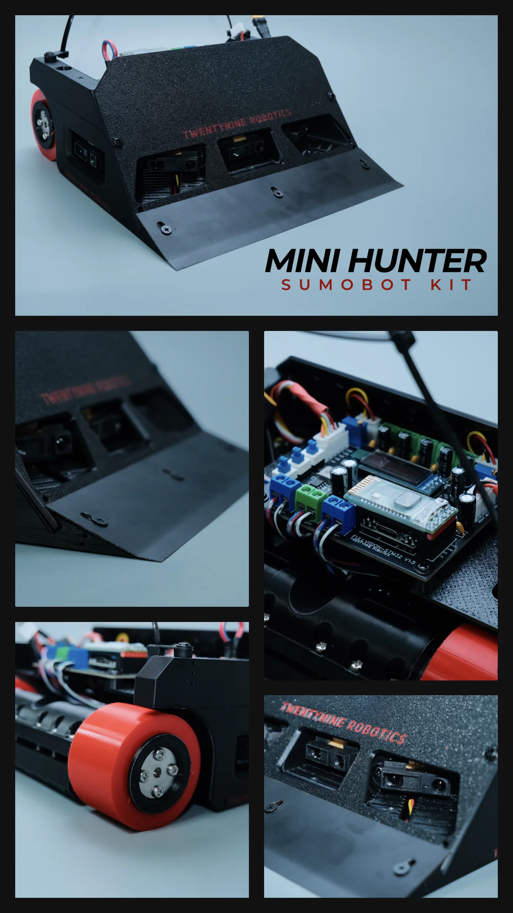

# Mini Hunter 1KG/3KG Sumobot Kit

The robot normally arrives with working firmware already installed. Start by learning the controls and completing the safety checks. Open the Programming section only when you want to reinstall or customize the code.

<figure class="guide-figure product-showcase">
  
  <figcaption><strong>Meet the Mini Hunter.</strong> This multi-angle reference shows the assembled robot, front blade, FullVision controller board, drive wheel, and front sensor openings. Select the image to view it at full size.</figcaption>
</figure>

<strong>Guide status:</strong> <strong>In progress</strong> pages contain usable instructions but still need verified sections or supporting material. <strong>Pending</strong> pages are planned and should not yet be used as complete procedures.

  START HERE — NO PROGRAMMING REQUIRED
  <h2>Learn how to use your Mini Hunter</h2>
  
Identify the controls, check the robot, choose RC/RMT or AUTO, calibrate the sensors, and complete a safe first test.

  <a class="primary-action" href="getting-started.html">Start using the robot →</a>

  <section>
    <h2>Getting started</h2>
    <a class="directory-link" href="getting-started.html"><strong>Start using your Mini Hunter</strong><small>Safe checks, board controls, controller choice, AUTO, and first operation.</small>→</a>
    <a class="directory-link" href="modes/introduction.html"><strong>Modes introduction</strong><small>Understand BT, RC, calibration, and the installed autonomous modes.</small>→</a>
    <a class="directory-link" href="hardware/wheels-gears-checkup.html"><strong>Before-match wheels &amp; gears check-up</strong><small>Check loose wheels and service their set screws before a match.</small>In progress</a>
  </section>
  <section>
    <h2>Controllers and calibration</h2>
    <a class="directory-link" href="bluetooth-application-setup.html"><strong>Bluetooth application setup</strong><small>Install the Android app and import the Mini Hunter V2.6 panel.</small>In progress</a>
    <a class="directory-link" href="rc-controller-setup.html"><strong>RC controller setup</strong><small>Connect RC Cable V1, bind the receiver, and test every control.</small>→</a>
    <a class="directory-link" href="calibration/"><strong>Calibration</strong><small>Adjust line sensors and check enemy-detection distances.</small>→</a>
  </section>
  <section>
    <h2>Hardware and upgrades</h2>
    <a class="directory-link" href="attachments/"><strong>Attachment guides</strong><small>Robohockey, front plates, and weight adjustment.</small>Pending</a>
    <a class="directory-link" href="upgrades/"><strong>Upgrade kits</strong><small>3 kg upgrade, RC conversion, and blade swapping.</small>Pending</a>
  </section>
  <section>
    <h2>Programming</h2>
    <a class="directory-link" href="setup-and-first-upload.html"><strong>Arduino IDE, board setup &amp; uploading</strong><small>Install the programming tools, verify the sketch, connect, and upload.</small>In progress</a>
    <a class="directory-link" href="downloads.html"><strong>Programming downloads</strong><small>FullVision installer, Arduino IDE, STM32CubeProgrammer, and libraries.</small>→</a>
    <a class="directory-link" href="programming/common-settings.html"><strong>Common firmware settings</strong><small>Select 1KG/3KG values and tune scan, attack, speed, and delay settings.</small>→</a>
    <a class="directory-link" href="modes/customization.html"><strong>Modes customization</strong><small>Choose system and mode counts, then edit behaviors safely.</small>In progress</a>
    <a class="directory-link" href="code-library/"><strong>FullVision function library</strong><small>Search functions, examples, expected outputs, and cautions.</small>→</a>
    <a class="directory-link" href="programming/pin-map.html"><strong>FullVision STM32 pin map</strong><small>See each STM32 pin and its job on the controller board.</small>→</a>
  </section>
  <section>
    <h2>Help</h2>
    <a class="directory-link" href="troubleshooting/"><strong>Troubleshooting</strong><small>Find checks and corrective actions by symptom.</small>In progress</a>
  </section>

