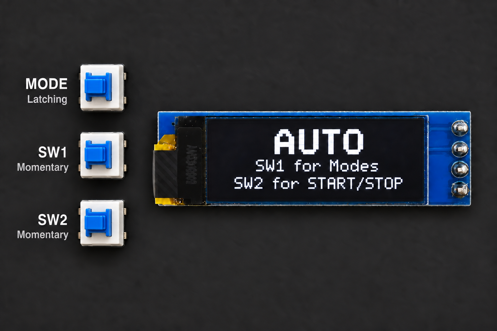
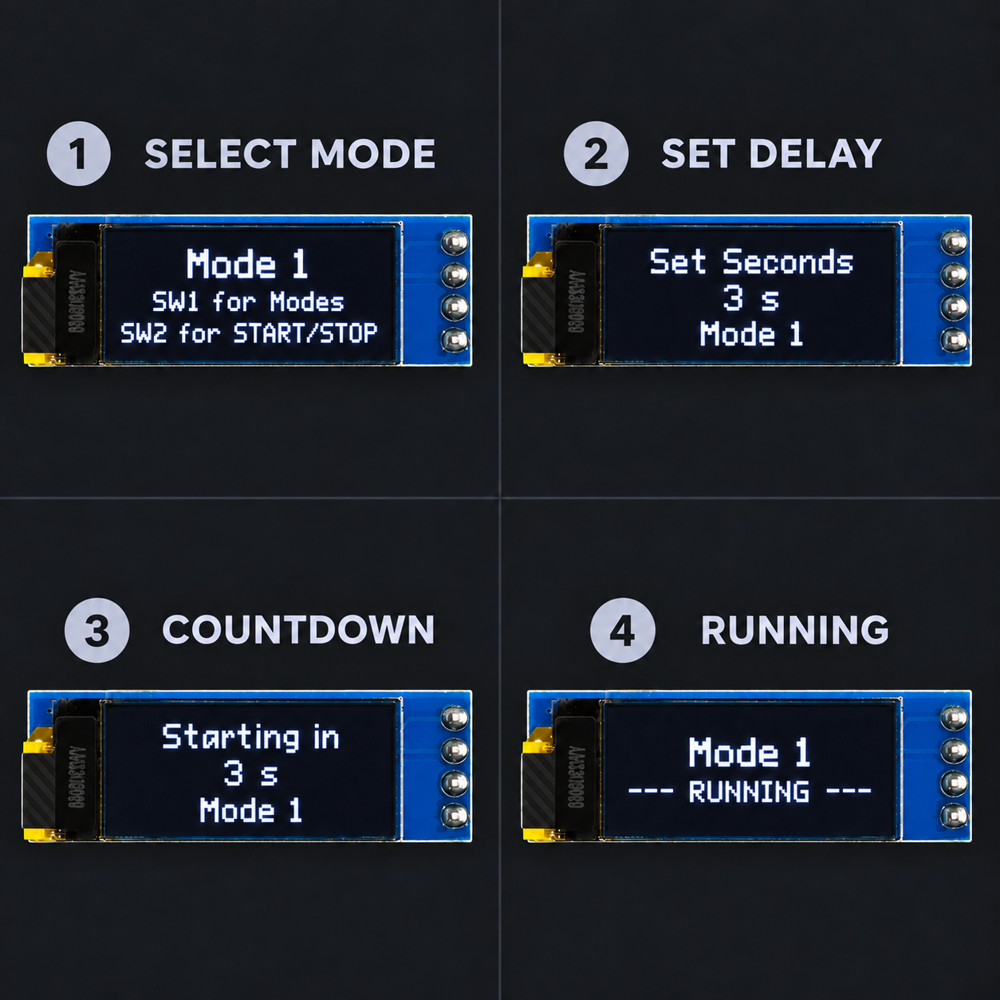

# Modes introduction

A **control mode** decides where movement commands come from. An **autonomous mode number** selects one programmed behavior. These are related, but they are not the same thing.

## Know the three menu controls

<figure class="guide-figure">
  
  <figcaption><strong>MH-MODES-01.</strong> Menu-control reference based on the supplied firmware and board artwork. The three blue rectangular switches are arranged vertically at the board's lower-left; they are not generic tactile switches. The OLED is installed with its soldered pins on the right.</figcaption>
</figure>

| Control | Switch behavior | What it does in the menu |
| --- | --- | --- |
| **MODE** | Latching | Chooses the AUTO menu family or the RC/RMT menu family. It stays in its selected position. |
| **SW1** | Momentary | Moves through the choices shown for the selected menu family. |
| **SW2** | Momentary | Confirms and starts the selected choice when the firmware allows it. |

The screen wording is generated by the code. The current library sets `display.setRotation(2)`, which keeps the text upright while the module's soldered pins are physically on the right.

## Control choices shown by the robot

| Display choice | Meaning | Use it when |
| --- | --- | --- |
| `AUTO` / numbered mode | Autonomous behavior | The robot should use its sensors and selected program without continuous driving input. |
| `BT MODE` | Bluetooth control | A compatible Android panel will send commands. |
| `RC MODE` | RC receiver control | A verified transmitter and receiver will send channel pulses. |
| `JS MODE` | Joystick mode label | The current code contains this display label, but the shared build does not expose it in the normal selector. |

After reset, the latching MODE switch determines whether the main screen says **AUTO** or **RC/RMT**. The RC/RMT selector cycles through the choices enabled by the code. Read the OLED before confirming; do not assume the last-used selection is still active.

In the shared build, `NUM_RCRMT` is `2`, so SW1 normally cycles through Bluetooth and RC. A `JS MODE` display case exists for selection 3, but it is not reachable through the normal menu while that limit remains 2. Do not change the limit merely to reveal the label; joystick operation also needs verified supporting code and hardware.

## What the AUTO sequence looks like

<figure class="guide-figure">
  
  <figcaption><strong>MH-MODES-02.</strong> AUTO sequence reconstructed from the current sketch: select a mode, set its delay, watch the countdown, and enter the running state. The shown three-second value is an example; the code allows 0–5 seconds.</figcaption>
</figure>

1. Use **SW1** to move from `AUTO` to the numbered autonomous mode you want.
2. Press **SW2** to confirm it. The `Set Seconds` screen appears.
3. Use **SW1** to choose a delay from 0 through 5 seconds, then press **SW2** to confirm.
4. The OLED counts down and then shows the selected mode as running.

## Systems versus modes

- A **3-system** robot uses front-left, front, and front-right enemy sensors.
- A **5-system** robot adds left and right enemy sensors.
- A **4-mode** program contains four selectable autonomous behaviors.
- A **7-mode** program contains seven selectable autonomous behaviors.
- **1 kg** and **3 kg** describe hardware/competition configurations; they do not automatically prove which sensor or mode count is loaded.

Check both the physical robot and the program configuration before uploading.

## Safe first run

1. Confirm the intended firmware and control mode.
2. Check battery security, attachments, and blade clearance.
3. Test sensor readings in calibration mode.
4. Perform the first movement test on a stand or in a controlled test area.
5. Keep a direct way to remove power.
