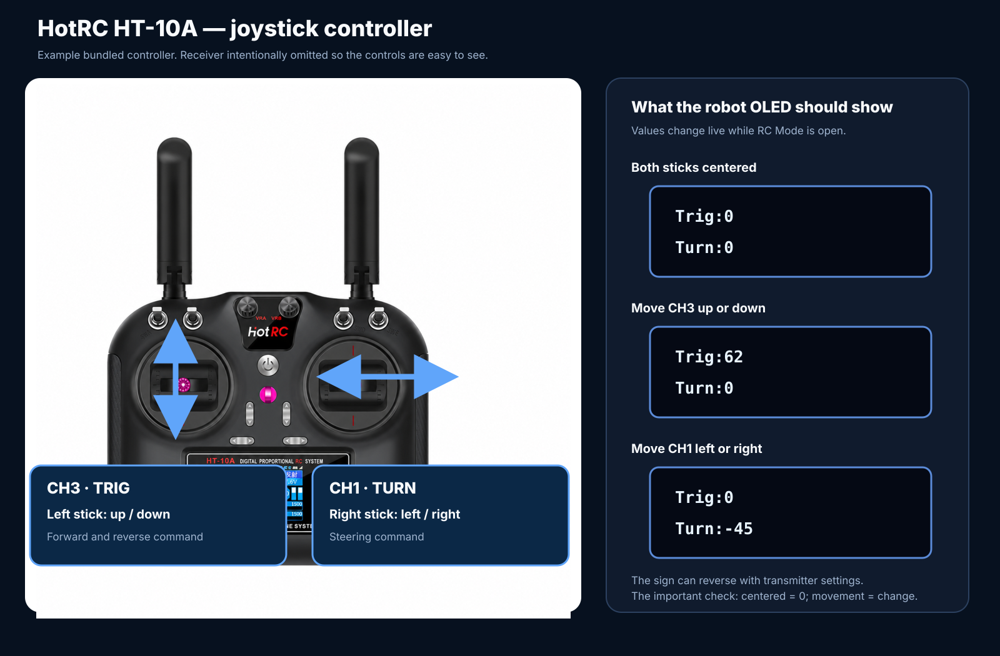
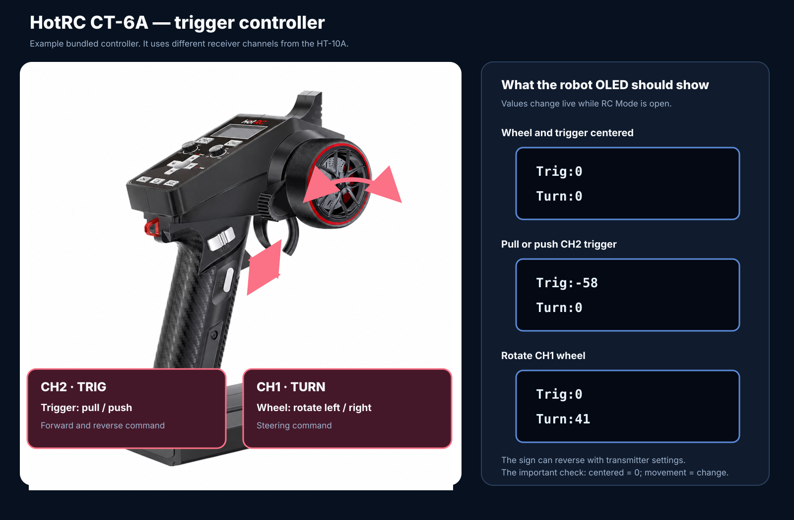
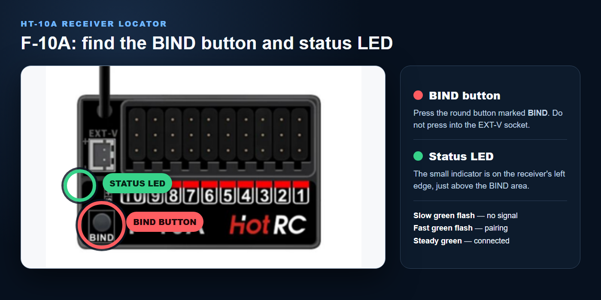
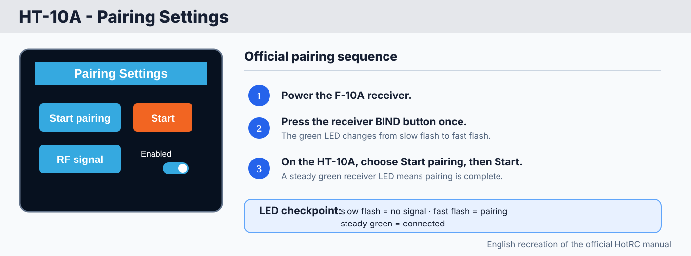
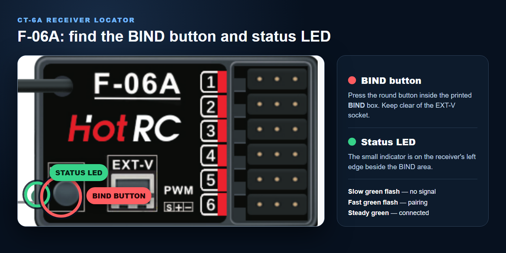
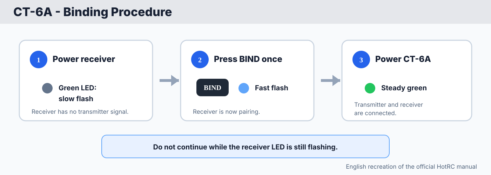
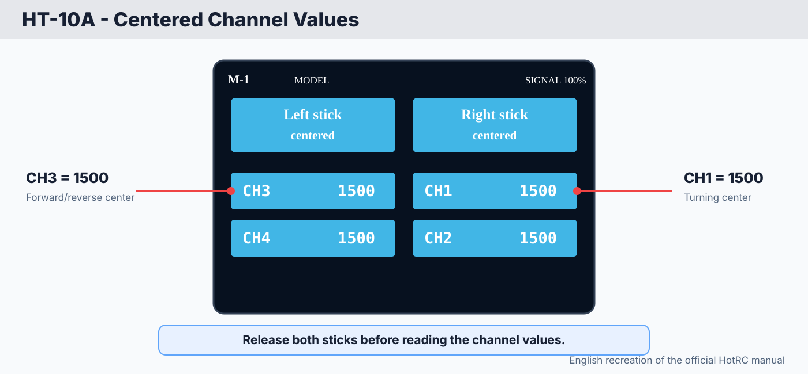
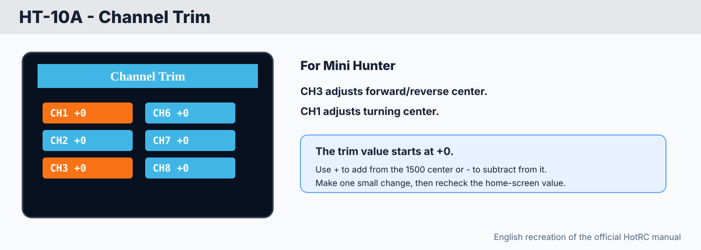
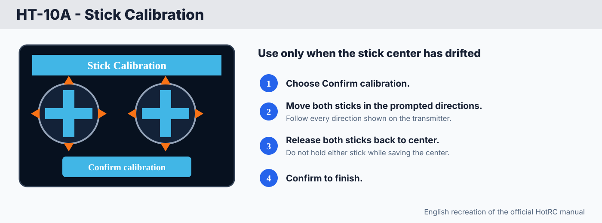
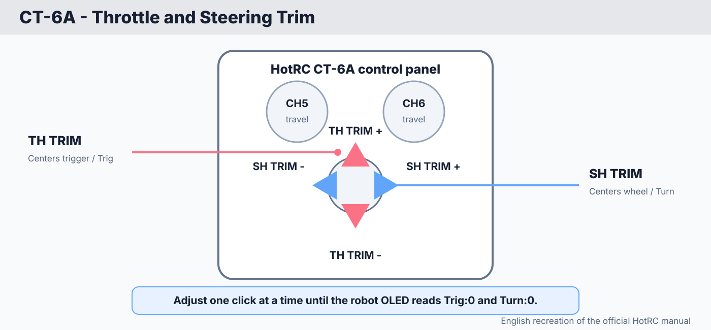

# RC controller setup

Ready — visual guide

Use this guide to prepare the supplied RC controller, connect its receiver to the Mini Hunter, bind the controller and receiver, and check the live control values safely.

<strong>RC Cable V1 record:</strong> This procedure intentionally uses <strong>RC Cable V1</strong>, which is normally supplied with the Mini Hunter kit. Keep this cable with the robot. A different-looking receiver cable may have a different pin arrangement and must not be connected by guesswork.

## Identify your bundled controller first

The kit may include either controller below. They do **not** use the same throttle channel.

| Bundled controller | Receiver channels for RC Cable V1 | Forward/reverse control | Turning control |
|---|---|---|---|
| **HotRC HT-10A** twin-stick | CH3 and CH1 | CH3 — left stick up/down | CH1 — right stick left/right |
| **HotRC CT-6A** trigger type | CH2 and CH1 | CH2 — trigger pull/push | CH1 — steering wheel left/right |

<strong>Use the row for your controller.</strong> Connecting a CT-6A as though it were an HT-10A can put the wrong control on <code>Trig</code>. The robot-side connection is the same, but the receiver channel numbers are different.

<figure class="guide-figure step-figure">
  
  <figcaption><strong>HT-10A:</strong> Move the left stick vertically for <code>Trig</code>. Move the right stick horizontally for <code>Turn</code>. The separate receiver is omitted from the picture so the controls remain clear.</figcaption>
</figure>

<figure class="guide-figure step-figure">
  
  <figcaption><strong>CT-6A:</strong> Pull or push the CH2 trigger for <code>Trig</code>. Rotate the CH1 wheel for <code>Turn</code>. This is an example of the trigger-style controller bundled with some kits.</figcaption>
</figure>

## What you need

- Mini Hunter 1KG or 3KG Sumobot Kit
- Compatible HotRC transmitter and receiver supplied with the kit
- **RC Cable V1**, normally included with the kit
- The battery type required by the bundled transmitter
- A stable stand or block that can hold the robot with both wheels off the surface

## Before you begin

1. Turn off the robot.
2. Turn off the RC transmitter.
3. Remove the blade or other attachment if it could move during testing.
4. Place the robot on a stable stand so its wheels cannot touch the table or floor.
5. Keep hands, cables, tools, and loose objects away from the wheels.

<strong>Test with the wheels raised.</strong> A newly connected receiver can send an unexpected command if its channels are connected incorrectly. Do not perform the first test with the robot resting on its wheels.

## 1. Prepare the RC transmitter

1. Open the battery compartment at the back of the transmitter.
2. Install the battery type supplied or specified for that transmitter. Match the `+` and `−` markings in the battery compartment.
3. Close the battery cover securely.
4. Turn on the transmitter.
5. If the transmitter asks for a language, use the buttons beside the screen to select **English**.
6. For an HT-10A, install the supplied thumb pins or stick extensions if they are not already installed. For a CT-6A, make sure the steering wheel and trigger return freely to center.

### Check the control channels

Use the transmitter's channel display to confirm the controls for your model:

| Control movement | Channel shown on the transmitter | Robot function after setup |
|---|---:|---|
| HT-10A left stick up and down | CH3 | Forward and reverse |
| HT-10A right stick left and right | CH1 | Turn left and right |
| CT-6A trigger pull and push | CH2 | Forward and reverse |
| CT-6A steering wheel left and right | CH1 | Turn left and right |

Move only one control at a time. Confirm that its channel responds, then allow the control to return to center.

## 2. Connect RC Cable V1 to the receiver

Leave the transmitter on with both sticks centered. The robot must remain powered off while the receiver cable is connected.

1. Find the correct receiver connections for your controller:

   - HT-10A: **CH3 and CH1**
   - CT-6A: **CH2 and CH1**

2. Connect the two receiver ends of RC Cable V1 to those channels.
3. On each receiver connection, keep the wire colors aligned with the receiver markings:

   - Yellow wire → `S` for signal
   - Red wire → `+` for power
   - Black wire → `−` for ground

If the two channel leads are not labeled, either complete lead may be placed on either of the two required channels for the first supported-wheel test. If <code>Trig</code> and <code>Turn</code> respond to the wrong controls, swap the **two complete channel plugs**.

<strong>Do not reverse the wire colors.</strong> Swapping the two complete channel plugs is different from reversing the wires inside a plug. Yellow must remain on <strong>S</strong>, red on <strong>+</strong>, and black on <strong>−</strong>.

## 3. Connect the receiver to the Mini Hunter

1. Confirm that the robot is still powered off.
2. Locate the Bluetooth module on the FullVision STM32 board.
3. Carefully unplug the Bluetooth module from its header. Pull it straight out without bending its pins.
4. Connect the robot-side plug of RC Cable V1 to the same board header, with the cable bend facing **right**. This is the opposite direction from the Bluetooth cable, which bends left.
5. Place the receiver where it cannot touch the wheels, blade, or loose metal parts.
6. Check every connection once more before applying power.

The Bluetooth module and RC receiver use the same controller connection in this setup. Do not try to install both at the same time.

## 4. Bind the receiver and transmitter

Use the procedure for the controller and receiver supplied with your kit.

### HT-10A with F-10A receiver

<figure class="guide-figure step-figure">
  
  <figcaption><strong>F-10A receiver locator.</strong> The coral circle identifies the round BIND button; the green circle identifies the small status LED on the receiver's left edge. Use the printed labels on the receiver to confirm the locations before pressing anything.</figcaption>
</figure>

<figure class="guide-figure step-figure">
  
  <figcaption><strong>HT-10A manual reference in English.</strong> The blue control is Start pairing; the orange button is Start. The receiver LED must change from fast flashing to steady green.</figcaption>
</figure>

1. Leave the HT-10A powered off and center both sticks.
2. Power the robot and F-10A receiver. A slow green flash means the receiver has no transmitter signal.
3. Press the F-10A receiver's **BIND** button once. The green LED should flash quickly.
4. Power on the HT-10A and open **Pairing Settings**.
5. Select **Start Pairing**, then press the orange **Start** button shown in the manual.
6. Wait for the receiver LED to remain steadily green.

### CT-6A with F-06A receiver

<figure class="guide-figure step-figure">
  
  <figcaption><strong>F-06A receiver locator.</strong> The coral circle identifies the round BIND button inside its printed box; the green circle identifies the small status LED on the receiver's left edge. Do not confuse either with the EXT-V socket.</figcaption>
</figure>

<figure class="guide-figure step-figure">
  
  <figcaption><strong>CT-6A manual reference in English.</strong> Power the receiver, press BIND once, and then power the transmitter. Slow flash means no signal, fast flash means pairing, and steady green means connected.</figcaption>
</figure>

1. Leave the CT-6A powered off and release the wheel and trigger so they return to center.
2. Power the robot and F-06A receiver. Its green LED should flash slowly.
3. Press the F-06A receiver's **BIND** button once. Its green LED should flash quickly.
4. Turn on the CT-6A transmitter.
5. Wait for the receiver LED to remain steadily green.

<strong>Binding checkpoint:</strong> A steady receiver LED indicates that binding is complete. If the LED continues blinking, turn the robot off and repeat this section. Do not continue to the movement test until the connection is stable.

For the complete manufacturer documents, open [HotRC technical support](https://www.hotrc.cn/support/7.html), then select **HT-10A** or **CT-6A** and choose the manual link for that model.

## 5. Center the transmitter channels

Center the transmitter before allowing the wheels to touch a surface.

### HT-10A channel values

1. Release both sticks and remove your hands from them.
2. On the HT-10A home screen, check **CH3** and **CH1**. Both should read approximately **1500** at center.

<figure class="guide-figure step-figure">
  
  <figcaption><strong>HT-10A centered reference in English.</strong> CH3 and CH1 should both read 1500 when the sticks are released at center.</figcaption>
</figure>

3. If either channel has a small offset, open **Channel Trim** and adjust only that channel toward its 1500 center. In the manual, `+` adds to the 1500 center and `−` subtracts from it.

<figure class="guide-figure step-figure">
  
  <figcaption><strong>HT-10A Channel Trim in English.</strong> Use CH3 for forward/reverse and CH1 for turning. Make small adjustments and recheck the home-screen values.</figcaption>
</figure>

4. If the physical stick center is still incorrect after removing trim, open **Stick Calibration**. Start calibration, follow the on-screen stick movements, return both sticks to their center positions, and confirm.

<figure class="guide-figure step-figure">
  
  <figcaption><strong>HT-10A Stick Calibration in English.</strong> Use it only when the stick center has drifted: begin calibration, follow the direction prompts, return the sticks to center, and confirm.</figcaption>
</figure>

### CT-6A trim controls

The CT-6A manual identifies dedicated **TH TRIM** controls for throttle and **SH TRIM** controls for steering. It does not provide the same CH1/CH2 numeric home-screen view as the HT-10A, so use the Mini Hunter OLED for the final zero check.

<figure class="guide-figure step-figure">
  
  <figcaption><strong>CT-6A trim reference in English.</strong> TH TRIM corrects the trigger's throttle center. SH TRIM corrects the steering-wheel center. Adjust one click at a time.</figcaption>
</figure>

1. Release the trigger and steering wheel so both return naturally to center.
2. Continue to RC Mode below and observe the robot OLED.
3. If <code>Trig</code> is not zero, tap the appropriate **TH TRIM** direction once, then recheck.
4. If <code>Turn</code> is not zero, tap the appropriate **SH TRIM** direction once, then recheck.
5. Stop as soon as the OLED settles at <code>Trig:0</code> and <code>Turn:0</code>. Do not hold a trim button or make large adjustments.

## 6. Select RC Mode

1. Keep the robot supported with its wheels raised.
2. Use the switches on the FullVision STM32 board to display **RC MODE** on the OLED.
3. Select RC Mode.
4. Leave both transmitter controls centered and watch the OLED and wheels.

The OLED should show <code>Trig:0</code> and <code>Turn:0</code>, and both wheels should remain stopped. If a value does not settle near zero or either wheel moves, turn off the robot immediately and see [If the robot moves at neutral](#if-the-robot-moves-at-neutral).

## 7. Test and correct the controls

Use small control movements during the first test. Values can run from <code>-100</code> to <code>100</code>; the sign may reverse if a transmitter channel is reversed.

1. Move the forward/reverse control slightly: HT-10A left stick vertically, or CT-6A trigger pull/push. Only <code>Trig</code> should change.
2. Return the control to center. <code>Trig</code> should return to <code>0</code> and the wheels should stop.
3. Move the turning control slightly: HT-10A right stick horizontally, or CT-6A steering wheel left/right. Only <code>Turn</code> should change.
4. Return the control to center. <code>Turn</code> should return to <code>0</code> and the wheels should stop.
5. Repeat with small movements while confirming the robot responds in the expected direction.

### If forward/reverse and turning use the wrong sticks

1. Turn off the robot.
2. Turn off the transmitter.
3. At the receiver, swap the two **complete channel plugs** between the required channel pair: CH1/CH3 for HT-10A, or CH1/CH2 for CT-6A.
4. Keep the yellow, red, and black wires in their correct `S`, `+`, and `−` orientation.
5. Power the system again, select RC Mode, and repeat the supported-wheel test.

If the correct stick controls the correct function but the direction itself is reversed, stop testing and confirm the transmitter's channel-reverse setting for the supplied controller. Do not change the receiver's signal, power, or ground order.

## If the robot moves at neutral

1. Turn off the robot immediately.
2. Return both transmitter controls to their center positions.
3. Center the transmitter trims.
4. Confirm that the correct transmitter model memory is selected.
5. Check that the two RC Cable V1 receiver plugs are fully seated and correctly aligned.
6. Repeat the test with the wheels raised.

Do not place the robot on the arena until all four commands work correctly and both wheels stop whenever the transmitter controls return to center.

## Final checklist

- [ ] RC Cable V1 is connected securely.
- [ ] Yellow is on `S`, red is on `+`, and black is on `−` at the receiver.
- [ ] The Bluetooth module has been removed from the shared board header.
- [ ] The receiver LED remains steadily lit.
- [ ] RC Mode is selected on the robot.
- [ ] The correct control changes <code>Trig</code>: HT-10A CH3 stick or CT-6A CH2 trigger.
- [ ] The correct control changes <code>Turn</code>: HT-10A CH1 stick or CT-6A CH1 wheel.
- [ ] The OLED returns to <code>Trig:0</code> and <code>Turn:0</code> at neutral.
- [ ] The wheels stop when the transmitter controls are centered.
- [ ] The first complete test was performed with the wheels raised.

The original Twentynine Robotics demonstration used to prepare this guide is available in the [RC controller setup reference video](https://drive.google.com/file/d/1IzRf03yDP47ePiNyPkbAr98qOXkC-erA/view?usp=drive_link).
